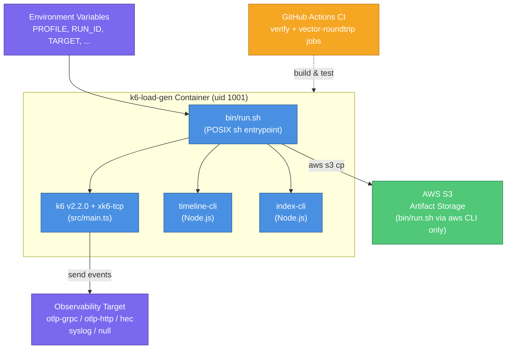
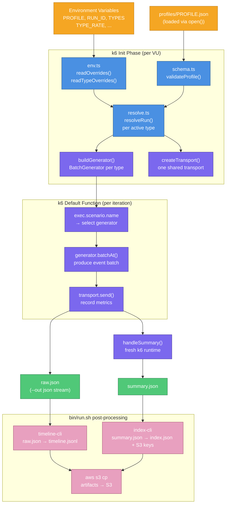
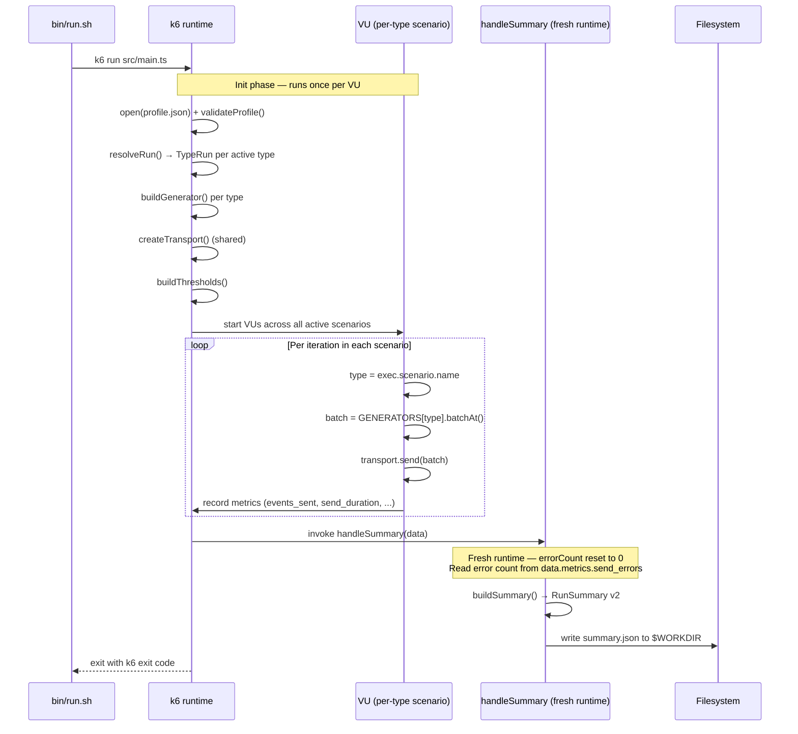
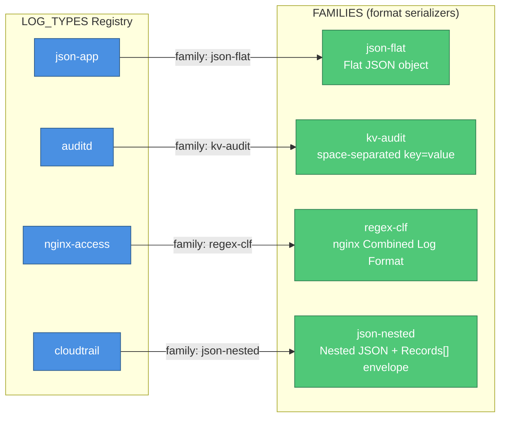
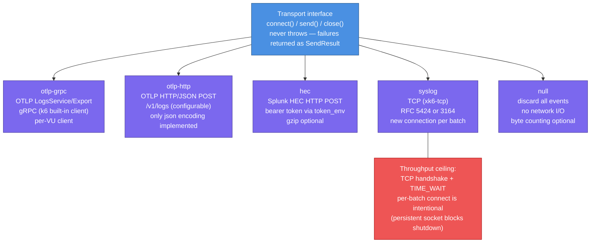
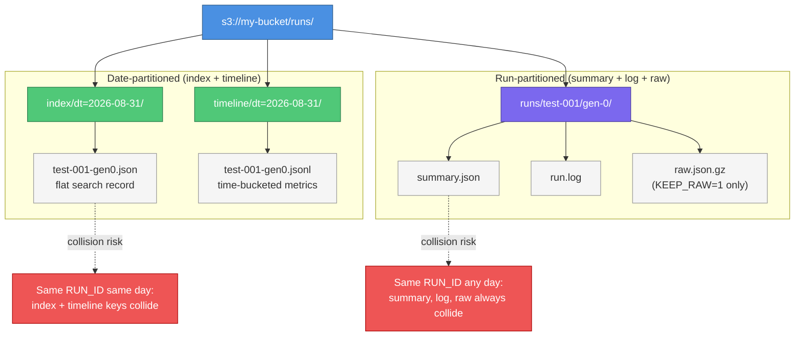

# k6-load-gen Architecture Overview

k6-load-gen is a containerized, outbound load-generation client. It has no server endpoints, no database, and no inbound network interfaces. Its sole function is to send synthetic log events at a controlled rate to a target observability pipeline and produce structured measurement artifacts.

The architecture is organized around k6's execution model with a strict runtime boundary separating the k6 script, two Node.js CLI tools, and the POSIX shell entrypoint.

---

## Table of Contents

1. [System Context](#1-system-context)
2. [Major Components](#2-major-components)
3. [Data Flow](#3-data-flow)
4. [k6 Execution Model](#4-k6-execution-model)
5. [Log Types and Format Families](#5-log-types-and-format-families)
6. [Transports](#6-transports)
7. [Configuration and Validation](#7-configuration-and-validation)
8. [Metrics and Summary](#8-metrics-and-summary)
9. [Artifact Storage](#9-artifact-storage)
10. [Aggregator Config Generator](#10-aggregator-config-generator)
11. [Security Architecture](#11-security-architecture)
12. [Key Design Decisions and Constraints](#12-key-design-decisions-and-constraints)

---

## 1. System Context

k6-load-gen is a **client** — it initiates all network connections and receives only response confirmations. It exposes no ports and accepts no inbound connections.

The diagram below shows the system boundary and every external system k6-load-gen interacts with. All connections are outbound.



### External Systems

**k6 runtime (v2.2.0 + xk6-tcp extension v0.3.1)**
The k6 runtime executes `src/main.ts` as a load test script. k6 provides the VU (virtual user) execution model, the metrics subsystem, the `ramping-arrival-rate` and `shared-iterations` executors, and the `handleSummary` hook. k6 is a hard dependency — the script cannot run outside the k6 runtime. The Dockerfile pins k6 v2.2.0 with the xk6-tcp extension, which is required by the syslog transport for TCP socket access. `K6_AUTO_EXTENSION_RESOLUTION=false` is set in the image to prevent runtime extension fetching (which would require egress to Grafana's build service, unavailable in a private VPC).

**Observability target**
Any endpoint accepting one of the five supported protocols: OTLP-gRPC, OTLP-HTTP/JSON, Splunk HEC, syslog over TCP (RFC 5424 or RFC 3164, with optional TLS), or the null discard sink.

**AWS S3 (optional)**
Artifact destination. Accessed exclusively by `bin/run.sh` via the `aws` CLI. The k6 script itself never touches S3. This separation keeps the ECS task role down to a single `s3:PutObject` permission.

**GitHub Actions CI**
Two parallel jobs run on every push and pull request:
- `verify`: typecheck, tests, aggregator-configs drift gate, CLI bundle build, and standalone-bundle verification.
- `vector-roundtrip`: starts a live Vector container and proves the committed aggregator configs actually parse what the generator emits. This job is separate from `verify` so a Docker or image-pull failure does not obscure code failures, and vice versa. GitHub-hosted ubuntu-latest runners carry Docker preinstalled; no additional setup step is needed.

### Runtime Boundaries

The k6 script boundary is strict. `src/main.ts` and all files it imports are k6-only TypeScript code, compiled with a `tsconfig.json` that sets `types: ["@types/k6"]`. The Node CLI tools (`timeline-cli`, `index-cli`) and the aggregator tool are explicitly excluded from the k6 tsconfig and covered by `tsconfig.node.json`. A file cannot be imported in both contexts.

---

## 2. Major Components

### k6 Script (`src/main.ts` and imports)

The primary executable. Runs inside the k6 runtime. Responsible for:

- Loading and validating the profile at init time
- Building one `BatchGenerator` and one k6 scenario per active log type
- Creating the shared transport
- Dispatching each VU iteration to the correct generator based on `exec.scenario.name`
- Producing the run report (`summary.json`) via `handleSummary`

### Shell Wrapper (`bin/run.sh`)

POSIX sh container entrypoint. Orchestrates the entire test lifecycle:

1. Resolve `EMIT_TIMELINE` (env var, or read from profile via `index-cli`)
2. Create `$WORKDIR` (default `/tmp/k6run`)
3. Run k6 using a named-pipe construct to preserve k6's exit code through log capture
4. Post-process the sample stream into `timeline.jsonl` (via `timeline-cli`)
5. Ship artifacts to S3 or a local directory

This is a **start-run-exit** process. There is no loop, no daemon, no wait, and no trigger mechanism. When `bin/run.sh` finishes, the container exits with k6's own exit code.

### Timeline CLI (`src/timeline/cli.ts` → `dist/timeline-cli.js`)

A Node.js streaming process. Reads k6's `--out json` raw sample stream on stdin and outputs newline-delimited JSON time-bucketed metrics on stdout. Designed as a streaming pipeline to handle large input without loading it entirely into memory. Bundled into a standalone CJS file with no `node_modules` dependency at runtime.

### Index CLI (`src/storage/index-cli.ts` → `dist/index-cli.js`)

A Node.js utility with three sub-modes:
- `index-cli index < summary.json` — flattens a `summary.json` to a single-line search record for Athena, OpenSearch, or Splunk
- `index-cli keys <prefix> <output-dir> < summary.json` — derives S3 artifact keys from run identity and writes each to its own file
- `index-cli emit-timeline <profile.json>` — reads the profile's `emit_timeline` flag and returns `1` or `0`

### Aggregator Config Generator (`src/aggregator/cli.ts`)

A Node.js development tool, not included in the container image. Driven by `npm run aggregator-configs`. Reads `LOG_TYPES` from the live registry and renders Vector `remap` transform configs and Cribl pipeline configs for each log type, writing them to `aggregator-configs/<type>/vector/transform.json` and `aggregator-configs/<type>/cribl/pipeline.json`. CI runs a drift gate: regenerate and fail if the committed files differ.

### Profiles (`profiles/`)

JSON configuration files loaded by k6 at init time via `open()`. Six shipped profiles cover the major transport protocols and the multi-type use case. Profiles are the user-facing configuration surface; they do not contain credentials.

---

## 3. Data Flow

The end-to-end flow from environment variables through to artifacts:

The diagram below traces the complete data path from inputs to output artifacts. The dashed boundary separates the k6 runtime (left/center) from the Node.js post-processing tools (right).



**Inputs** — environment variables and profile file:

```
PROFILE, RUN_ID, TYPES, <TYPE>_RATE, ... (env vars)
  |
  v
src/config/env.ts
  |-- profileName()        -> profile filename
  |-- readOverrides()      -> RUN_ID, TARGET, GEN_INDEX, GEN_COUNT, DURATION_SCALE
  `-- readTypeOverrides()  -> active type subset + per-type rate/scenario/batch_size overrides
```

**Profile load and validation:**

```
open(profiles/<PROFILE>.json)
  |
  v
src/config/schema.ts :: validateProfile()
  |-- validates types map (each key must be a known log type name)
  |-- validates per-type TypeConfig fields (batch_size, anchor, scenario, cardinality)
  |-- validates transport options against per-transport allowlist
  `-- returns ValidationResult with collected error list (not early-exit)
```

**Resolution — one ResolvedRun produced per invocation:**

```
resolveRun(profile, overrides, typeOverrides)
  |
  for each active type:
  |-- resolveScenario()     -> concrete k6 scenario object (executor, stages, rate)
  `-- buildPayloadSpec()    -> merges LogTypeDef fields with cardinality overrides
        |
        `-> buildGenerator() -> BatchGenerator (the function that produces events)
```

**k6 execution:**

```
createTransport()   -> one shared Transport for all types
                       (e.g., otlp-grpc Client, HEC http.post closure, syslog socket factory)

k6 starts VUs:
  init phase:         all of the above runs once per VU
  default() per iteration:
    type = exec.scenario.name    (which scenario is executing this iteration)
    batch = GENERATORS[type].batchAt(iteration, now)
    transport.send(batch) -> eventsAttempted / eventsSent / sendDuration metrics

handleSummary():   runs in a fresh runtime after all VUs complete
  buildSummary()   -> RunSummary (schema_version 2)
  renderSummary()  -> human-readable stdout report
  -> summary.json written to $WORKDIR
```

**Post-processing (bin/run.sh):**

```
timeline-cli < raw.json  -> timeline.jsonl
index-cli index < summary.json  -> flat search record
index-cli keys <prefix> <dir> < summary.json  -> key files
aws s3 cp summary.json s3://bucket/prefix/runs/<run_id>/gen-<n>/summary.json
aws s3 cp timeline.jsonl s3://bucket/prefix/timeline/dt=<date>/<run_id>-gen<n>.jsonl
aws s3 cp (flat record) s3://bucket/prefix/index/dt=<date>/<run_id>-gen<n>.json
```

---

## 4. k6 Execution Model

The diagram below shows the three-phase execution model. Note the fresh-runtime boundary before `handleSummary` — module-scope variables such as `errorCount` are re-initialized to zero in that phase.



### Init Phase

k6 evaluates `src/main.ts` once per VU before the test starts. The init phase:

1. Reads `__ENV.PROFILE` and opens the profile file from disk via `open()`
2. Parses and validates the profile (all errors collected before throwing)
3. Reads and validates type overrides from environment variables
4. Calls `resolveRun()` to produce the `ResolvedRun` — one `TypeRun` per active type
5. Calls `buildGenerator()` for each active type — creates the `GENERATORS` map
6. Calls `buildThresholds()` — registers per-type structural thresholds and any profile SLO thresholds
7. Calls `createTransport()` — establishes (or prepares) the shared transport
8. Exports the `options` object (scenarios map, thresholds, summaryTrendStats)
9. Builds `PAYLOAD_SAMPLE` — first iteration's output for each active type (used in the summary)

Each VU has its own copy of all module-scope state. `errorCount`, `connected`, and the gRPC `client` object are per-VU. There is no shared mutable state between VUs.

### Default Function

k6 calls `default()` once per iteration for each VU in each active scenario. The scenario name (`exec.scenario.name`) identifies which log type this iteration serves. The corresponding `BatchGenerator` is dispatched to produce a batch of events, which is then sent via the shared transport.

When `send()` returns `ok: false`, `connected` is reset to `false` (forcing a reconnect on the next iteration), `sendErrors` is incremented, and the error is logged with per-VU rate limiting (first 10 errors, then every 1000th).

### handleSummary

`handleSummary` runs exactly once, globally, after all VUs complete. It runs in a **fresh k6 runtime** — `src/main.ts` is re-evaluated top to bottom, and all module-scope variables are re-derived from disk and environment. The `errorCount` variable is reset to 0 in this runtime. The only data that crosses from VU runtimes into `handleSummary` is the `data` parameter: the k6 metrics map and `state.testRunDurationMs`. Any code in `handleSummary` that needs to know how many errors occurred must read `data.metrics.send_errors.values.count`, not `errorCount`.

This fresh-runtime behavior has a practical consequence: the profile file is re-read from disk in `handleSummary`. If the profile file is modified after the test starts but before `handleSummary` runs, the summary reflects the modified file. In normal operation this does not occur, but it is relevant when extending `src/main.ts`.

### Named-Pipe Log Capture

`bin/run.sh` uses a named FIFO to capture k6 output and preserve k6's exit code simultaneously:

```sh
mkfifo "$FIFO"
tee "$LOG" < "$FIFO" &    # background: drains FIFO to $LOG and container stdout
TEE_PID=$!

k6 $K6_ARGS > "$FIFO" 2>&1   # k6 writes all output to FIFO
K6_EXIT=$?                    # exit code captured immediately after k6 exits

wait "$TEE_PID"               # wait for tee to flush $LOG
rm -f "$FIFO"
```

A plain `k6 ... | tee "$LOG"` pipeline would lose k6's exit code because POSIX sh does not support `set -o pipefail`. The FIFO construct solves this: k6 is not in a pipeline, so `$?` captures its actual exit code. `tee` also writes to the container's own stdout, so k6 progress output is visible to CloudWatch Logs in real time during a Fargate run.

### Structural Thresholds

For each active type, six trivially-true thresholds are registered (e.g., `events_sent{scenario:auditd}: count>=0`). These "plumbing thresholds" do not gate pass/fail — they exist solely to force k6 to expose the tagged sub-metric in `handleSummary`'s metrics data, which is the only way to get per-type metric breakdowns in the summary. `buildSummary()` uses `isStructuralThreshold()` to exclude them from the `slo` list in `RunSummary`. They appear in k6's console output during the run; this is expected. A profile with three active types generates 18 structural thresholds plus any SLO thresholds the profile declares.

---

## 5. Log Types and Format Families

The four registered log types each map to one format family. The format family's `serialize()` function produces the event body string that is transmitted on the wire.



### Log Type Registry

`LOG_TYPES` is a map from type name to `LogTypeDef`. The four registered types are: `json-app`, `auditd`, `nginx-access`, `cloudtrail`. `getLogType(name)` throws with the list of available names if an unknown name is requested.

A `LogTypeDef` includes:
- `name` — the type identifier (matches the registry key)
- `family` — format family name
- `fields` — list of `LogTypeField` definitions with `FieldSpec` and optional parse metadata
- `constants` — key-value pairs always present in the output (e.g., `type=SYSCALL` for auditd)
- `severity` — how severity is determined (from a field value, or a constant)
- `envelope` — outer wrapper structure for the event body (used by cloudtrail's `Records[]`)

### Format Families

Each log type belongs to one format family. The family's `serialize()` function converts a list of resolved field values into the event body string.

| Family | Serialization | Used by |
|---|---|---|
| `json-flat` | Flat JSON object: `{"key":"value",...}` | `json-app` |
| `kv-audit` | Space-separated `key=value` pairs with quoting for values containing spaces, `"`, or `=` | `auditd` |
| `regex-clf` | nginx Combined Log Format: `$addr - $user [$time] "$method $uri $proto" $status $bytes "$ref" "$ua"` | `nginx-access` |
| `json-nested` | JSON object with dotted paths expanded to nested objects; wrapped in an array envelope when `def.envelope` is set | `cloudtrail` |

The `FAMILIES` map is implemented as a JavaScript Proxy. Accessing an unregistered family name throws immediately with the list of available families. This converts a silent `undefined` (which would produce a confusing `TypeError` at call time) into a clear error at access time.

### Payload Generation

`buildPayloadSpec()` merges a `LogTypeDef`'s field list with cardinality overrides from the profile's `TypeConfig.cardinality` map. The result is a `PayloadSpec` with the merged `fields` array passed to `buildGenerator()`.

`buildGenerator()` produces a `BatchGenerator` — a stateful object that, given an iteration number and timestamp, returns a batch of `LogEvent` objects. Field values are drawn from pre-built cardinality pools using the configured distribution (uniform, Zipf, or weighted enumeration).

Each `LogEvent` includes:
- `ts_ms` — timestamp in milliseconds
- `severity` — derived from the type's severity definition
- `body` — the serialized event string (produced by the format family's `serialize()`)
- `fields` — the raw field values (used by transports that need structured access)
- `type` — the log type name (for in-process identity in multi-type runs; not sent on the wire by any transport)
- `run_id`, `gen_index`, `seq` — run identity fields

---

## 6. Transports

All five transports implement the same `Transport` interface and share a single instance per run. The diagram below shows each transport's wire protocol and the one connection-behavior difference worth noting for the syslog transport.



All five transports implement the `Transport` interface:

```typescript
interface Transport {
  readonly name: string;
  connect(): Promise<void>;
  send(events: LogEvent[], ctx: SendContext): Promise<SendResult>;
  close(): Promise<void>;
}
```

**Contract:** `send()` must never throw and must never reject. All failures are returned as `SendResult` data with `ok: false`. This ensures transport failures are counted as metrics rather than crashing the VU.

### Transport Implementations

**`otlp-grpc`**

Uses k6's built-in gRPC client with the OpenTelemetry `LogsService/Export` RPC. Proto files are loaded from `PROTO_ROOT` at init time. The gRPC client is per-VU (created in the init phase). TLS is disabled by default (`plaintext: true`). `resource_attributes` from the profile are merged with `service.name: "k6-load-gen"`. The `LogEvent.type` field and other internal fields are not included in the OTLP wire format — only `ts_ms`, `severity`, `body`, `run_id`, `gen_index`, and `seq` are mapped to OTLP log record fields.

**`otlp-http`**

Uses k6's built-in HTTP client to POST JSON-encoded OTLP `ExportLogsServiceRequest` payloads. Only the `"json"` encoding is implemented; the schema accepts `"protobuf"` as a syntactically valid option value, but the transport throws at init if it is set. `wire_bytes` is populated from the uncompressed JSON string length on successful sends.

**`hec`**

Uses k6's HTTP client to POST to the Splunk HTTP Event Collector endpoint. The HEC bearer token is read from the environment variable named by `target.options.token_env` (default `"HEC_TOKEN"`) at init time. If the variable is unset, the transport throws immediately — before any VU runs. The token is never logged, never included in metrics, and never appears in `summary.json` (the `redactProfile` allowlist excludes it). `wire_bytes` is populated from the uncompressed payload length when `gzip: false`.

**`syslog`**

Uses the xk6-tcp extension to open a TCP socket per batch (connect, write, destroy). This per-batch connect design is intentional: a persistent socket would prevent the k6 process from exiting cleanly at the end of a test. The consequence is a throughput ceiling determined by TCP handshake latency and the TIME_WAIT ephemeral-port ceiling. The transport supports RFC 5424 and RFC 3164 framing, octet-counted and LF framing, and optional TLS. A `finally` block in the send path guarantees socket cleanup even when send operations error, preventing process hang.

**`null`**

Discards all events without sending. Used for local calibration runs and for verifying the generator configuration and profile without a network target. `wire_bytes` is populated by summing event body lengths when `count_bytes: true` (the default).

### TLS Configuration

TLS is delegated to the underlying transport mechanism:

- `otlp-grpc`: controlled by `plaintext` option (default `true` = no TLS)
- `otlp-http` and `hec`: controlled by the URL scheme (`http://` vs `https://`)
- `syslog`: controlled by the `tls` boolean option (default `false`)

No application-level cryptography is implemented. The `otlp-grpc` transport defaults to plaintext — this is appropriate for load testing tools that often target internal endpoints, but operators targeting endpoints across untrusted networks should set `plaintext: false`.

---

## 7. Configuration and Validation

### Profile Validation (`src/config/schema.ts`)

`validateProfile()` performs comprehensive validation and collects all errors before returning (not early-exit). Key validated properties:

- `name`: non-empty string
- `target.transport`: strict enum of the five transport names
- `target.endpoint`: required for all transports except `null`
- `target.options`: per-transport strict allowlist via `TRANSPORT_OPTION_SPECS`, with per-key type checking
- `types`: required, non-empty object; each key validated against `LOG_TYPES`
- Per-type `TypeConfig`: `batch_size` (positive integer), `anchor` (discriminated union), `scenario` (one of 12 named shapes), `cardinality` (if present: each key must name a field with numeric cardinality; value must be positive integer)
- Legacy top-level fields (`payload`, `anchor`, `scenario`): explicitly rejected with migration guidance

Two `Object.prototype.hasOwnProperty.call()` guards prevent prototype pollution during transport option spec and log type name lookups.

### Environment Variable Validation (`src/config/env.ts`)

- **Numeric parsing**: the `num()` helper rejects `Infinity`, `-Infinity`, and `NaN` via `Number.isFinite()`. This prevents `RATE=Infinity` from propagating silently into scenario math.
- **Legacy variable rejection**: `RATE`, `SCENARIO`, `KNEE_EPS` throw with migration guidance if set.
- **`TYPES` validation**: rejects empty values, duplicates, and type names not declared in the profile.
- **Prefix collision detection**: throws if two profile type names produce the same env prefix.
- **Typo detection**: scans all `__ENV` keys for `_RATE`, `_KNEE_EPS`, `_SCENARIO`, `_BATCH_SIZE` suffixes and warns when the prefix does not match any declared type.

### Scenario Resolution (`src/scenarios/resolve.ts`)

`resolveScenario()` converts a named shape definition plus an anchor and fleet parameters into a concrete k6 scenario object. For `ramping-arrival-rate` shapes, it:

1. Multiplies each stage's target EPS by the anchor EPS (adjusted for fleet share: `eps / gen_count`)
2. Converts EPS to k6's `iterations_per_second` via `max(1, round(eps / batch_size))`
3. Applies `DURATION_SCALE` to all stage durations
4. Records `requested_peak_eps`, `achieved_peak_eps`, and `delta_pct` (the rounding drift at the worst stage)

For `shared-iterations` shapes (smoke), it returns `{executor, iterations, vus}` immediately — no stage math, no rate calculation, no `DURATION_SCALE` effect.

---

## 8. Metrics and Summary

### Custom Metrics

Six k6 custom metrics are declared in `src/metrics/registry.ts`:

| Metric | Type | Description |
|---|---|---|
| `events_attempted` | Counter | Events batched for sending |
| `events_sent` | Counter | Events successfully delivered |
| `send_failures` | Rate | Fraction of batch sends that failed |
| `send_duration` | Trend | Per-batch send latency in milliseconds |
| `send_errors` | Counter | Absolute count of failed batch sends |
| `wire_bytes` | Counter | Bytes sent (transport-dependent) |

All metrics support k6 tag filtering. The structural threshold pattern forces k6 to emit tagged sub-metrics (`events_sent{scenario:auditd}`) in `handleSummary`'s data even when no threshold is specified for that tag.

### RunSummary (schema_version 2)

The `summary.json` schema version 2 introduced a breaking change from version 1: the `thresholds` field changed from a flat map to `{ slo: SloThresholdEntry[], structural_count: number }`. Any consumer reading `Object.values(thresholds)` against a version 2 summary will misread the structure. The `schema_version: 2` field is the signal for consumers to apply the correct parsing.

The `TypeSummary.send_duration` field is a `Record<string, number> | null` (the full Trend statistics map: avg, min, med, max, p(90), p(95), p(99)), not a single number. `null` means no samples were recorded for that type in this run.

`validity.generator_cpu` is always `null`. The comment in the source notes that an external sub-project is expected to fill this field; no injection mechanism currently exists.

---

## 9. Artifact Storage

### S3 Key Structure

Given `RESULTS_URI=s3://my-bucket/runs`, `RUN_ID=test-001`, `GEN_INDEX=0`, `started_at=2026-08-31T14:00:00Z`:

```
s3://my-bucket/runs/index/dt=2026-08-31/test-001-gen0.json     <- flat search record
s3://my-bucket/runs/timeline/dt=2026-08-31/test-001-gen0.jsonl <- time-bucketed metrics
s3://my-bucket/runs/runs/test-001/gen-0/summary.json           <- run report
s3://my-bucket/runs/runs/test-001/gen-0/run.log                <- k6 console output
s3://my-bucket/runs/runs/test-001/gen-0/raw.json.gz            <- raw sample stream (if KEEP_RAW=1)
```

The diagram below shows the two-partition layout and which keys collide when the same `RUN_ID` is reused on the same calendar day.



The `summary`, `run_log`, and `raw` keys contain only `run_id` and `gen_index` — no timestamp. Two runs with the same `RUN_ID` and `GEN_INDEX` silently overwrite each other's `summary.json`, `run.log`, and `raw.json.gz`. The `index` and `timeline` keys include a `dt=` date partition from `started_at`, so runs on different calendar days land in different partitions, but same-day re-runs with the same `RUN_ID` still collide.

The operator is entirely responsible for `RUN_ID` uniqueness. The code provides no auto-generation and no collision detection.

### Shell Injection Safety

`run_id` is validated against `/^[A-Za-z0-9._-]+$/` before any key derivation. S3 keys are passed to `bin/run.sh` via individual files read with `$(cat file)` — command substitution of file content, which is never interpreted as shell syntax. This two-layer defense (allowlist validation + file-based passing) means neither layer alone is a single point of failure.

### Local Results URI

When `RESULTS_URI` is a local directory path, files are written flat (no date partitions), `index.json` is not generated, and the fleet-style S3 key layout does not apply. `KEEP_RAW=1` is still honored. In single-task fleet mode the flat layout gains `gen-<i>/` and `fleet/` subdirectories so the generators do not overwrite each other.

---

## 10. Aggregator Config Generator

The aggregator config generator (`src/aggregator/`) produces ready-to-deploy parsing configurations for Vector and Cribl from the same `LOG_TYPES` registry that drives the generator's event emission.

### Outputs

For each log type, two files are generated and committed to the repository:

- `aggregator-configs/<type>/vector/transform.json` — Vector `remap` transform
- `aggregator-configs/<type>/cribl/pipeline.json` — Cribl pipeline

### CI Drift Gate

The `verify` CI job runs `npm run aggregator-configs && git diff --exit-code -- aggregator-configs/`. If the live renderers produce output that differs from the committed files, CI fails. This prevents the log type definitions and the aggregator parse configurations from drifting apart.

### Vector Roundtrip CI

A separate `vector-roundtrip` CI job runs `tests/aggregator/roundtrip/run.sh`, which starts a real Vector container and feeds it output from the generator for each log type, asserting Vector parses it correctly. This proves the committed configs are correct against live Vector behavior, not just self-consistent. Docker is preinstalled on GitHub ubuntu-latest runners.

### Intended Consumption

The committed `aggregator-configs/` files are ready-to-deploy reference configurations. Operators copy or reference them in live Vector or Cribl deployments. Because the CI drift gate keeps them synchronized with the current generator output, they can be trusted without re-running the generator.

---

## 11. Security Architecture

### Credential Handling

The HEC transport uses an indirection pattern: the profile stores the environment variable name (e.g., `"token_env": "HEC_TOKEN"`), not the token itself. Profiles are safe to commit to version control. The token is read at init time; if the named variable is unset, the transport throws before any VU runs.

The `redactProfile()` function is called before the profile is embedded in `summary.json`. It uses an **allowlist** (`SAFE_OPTION_KEYS`) — any `target.options` key not on the allowlist is replaced with `"[redacted]"`. Unknown keys are redacted, not passed through. This is the safe direction for a credential protection mechanism: an omission causes redaction, not leakage.

The `otlp-http` `headers` option is explicitly excluded from the allowlist, because headers routinely carry `Authorization` values. When headers are set, the entire `headers` object is replaced with `"[redacted]"` in `resolved_config`.

### IAM Scope

Only `bin/run.sh` calls `aws s3 cp` (PutObject). The k6 script never imports or calls any AWS SDK. This separation keeps the ECS task role to a single `s3:PutObject` action on the target bucket prefix. No GetObject, ListBucket, DeleteObject, or KMS permissions are needed.

### Input Validation Security Properties

| Surface | Protection |
|---|---|
| Profile JSON | Strict schema validation; `hasOwnProperty` guards against prototype pollution |
| `run_id` | Allowlist `/^[A-Za-z0-9._-]+$/` prevents S3 path traversal and shell metacharacter injection |
| Numeric env vars | `Number.isFinite()` check rejects `Infinity`, `-Infinity`, `NaN` |
| Legacy env vars | Hard error on `RATE`, `SCENARIO`, `KNEE_EPS` prevents silent misconfiguration |
| S3 key passing | Keys written to files, read via `$(cat file)` — never interpreted as shell syntax |

### Syslog Format Injection Prevention

The syslog transport applies three sanitization functions before producing syslog messages:

- `escapeSdValue()` — backslash-escapes `\`, `"`, and `]` in structured data values per RFC 5424
- `oneLine()` — replaces `\r\n`, `\r`, `\n` with spaces in all free-text fields to prevent newline injection
- `sanitizeAppName()` — replaces characters outside the PRINTUSASCII range with `_`

The kv-audit format family applies equivalent protection: values containing spaces, double-quotes, or equals signs are quoted, and embedded double-quotes are escaped as `\"`.

---

## 12. Key Design Decisions and Constraints

### One Transport Per Run

All active types in a profile share one transport instance. This simplifies the transport creation path and ensures that all events from a run go to the same endpoint. It means you cannot send `json-app` events to one endpoint and `auditd` events to another in the same run.

### Per-Batch TCP Connection for Syslog

The syslog transport opens a new TCP connection for every batch. The alternative — a persistent per-VU socket — would prevent the k6 process from exiting cleanly when the test ends. The consequence is a throughput ceiling determined by connection establishment latency and the OS ephemeral-port ceiling. Users who need high-throughput syslog testing should be aware of this ceiling and use `batch_size` tuning to reduce connection frequency.

### handleSummary Fresh Runtime

k6 evaluates `handleSummary` in a fresh runtime where all module-scope state is re-initialized. This means `errorCount` is always 0 in `handleSummary`. Code that extends `src/main.ts` must use `data.metrics.send_errors.values.count` to access the run-wide error total.

### schema_version 2 Breaking Change

The `thresholds` field in `RunSummary` changed structure between version 1 and version 2. Version 1: flat map of threshold name to result. Version 2: `{ slo: [...], structural_count: N }`. Downstream consumers must check `schema_version` before parsing thresholds.

### No Cross-Task Fleet Coordinator

Fleet generators are independent k6 processes. There is no shared state, no leader election, and no cross-generator coordination while they run. Each generator produces its own artifacts. Within one task, `bin/run.sh` can run all N generators itself (`GEN_COUNT=N`, `GEN_INDEX` unset) and merge their summaries and timelines afterwards with `src/fleet/` — a post-run merge, not a coordinator. Across tasks, the same merge is available as `dist/fleet-cli.js merge` on downloaded `gen-<i>/` directories.

### No Run-to-Run Scheduling

`bin/run.sh` exits after one k6 run. There is no scheduling, delay, polling, or trigger mechanism. Running the container as a long-running ECS service that repeatedly restarts is not a supported pattern — see the [Deployment Guide](deployment-guide.md) for the implications and the supported ECS patterns.
