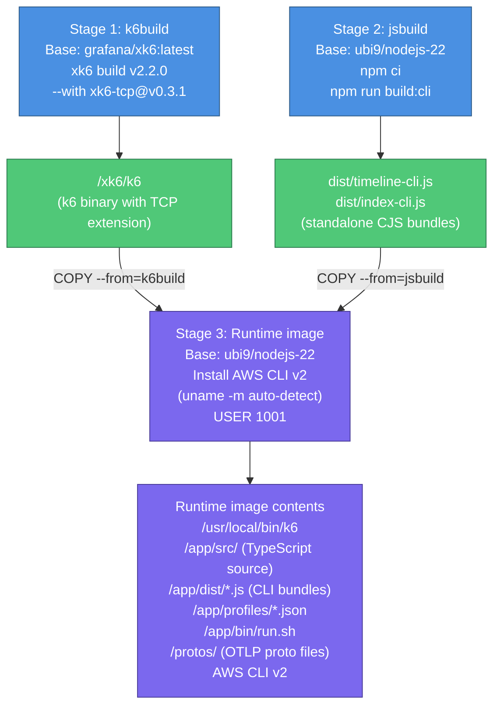
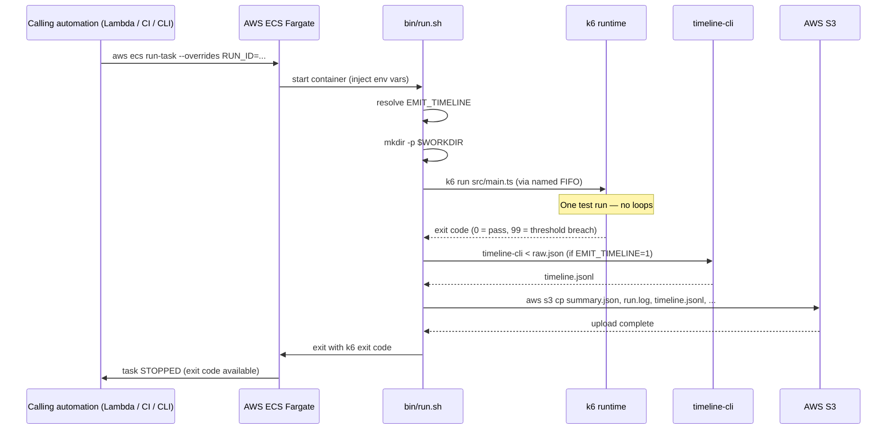
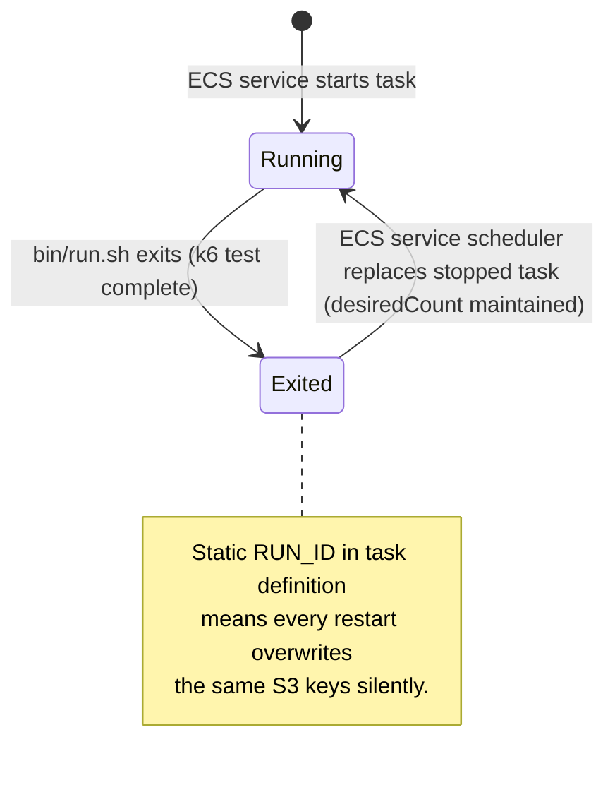
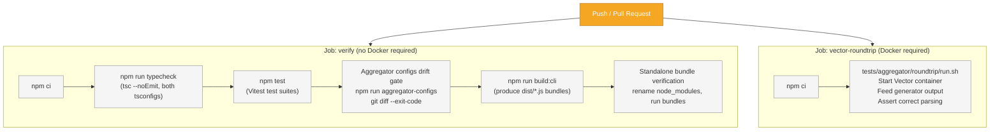

# k6-load-gen Deployment Guide

k6-load-gen is deployed as a container image. The Dockerfile uses a three-stage multi-stage build to produce a minimal runtime image. This guide covers building the image, running it locally, deploying on AWS ECS Fargate, fleet runs, CI integration, and monitoring.

---

## Table of Contents

1. [Container Image](#1-container-image)
2. [Running Locally](#2-running-locally)
3. [ECS Fargate Deployment](#3-ecs-fargate-deployment)
4. [ECS Execution Model: Run-Once Tasks](#4-ecs-execution-model-run-once-tasks)
5. [ECS Service Mode: What Happens and Why It Is Not Supported](#5-ecs-service-mode-what-happens-and-why-it-is-not-supported)
6. [Environment Variable Injection in ECS](#6-environment-variable-injection-in-ecs)
7. [IAM Configuration](#7-iam-configuration)
8. [Credentials: HEC Token and Secrets Manager](#8-credentials-hec-token-and-secrets-manager)
9. [S3 Artifact Bucket](#9-s3-artifact-bucket)
10. [Fleet Runs on ECS](#10-fleet-runs-on-ecs)
11. [Monitoring and Logs](#11-monitoring-and-logs)
12. [ECS Exec for Debugging](#12-ecs-exec-for-debugging)
13. [CI Integration](#13-ci-integration)
14. [Hardening and Base Image Substitution](#14-hardening-and-base-image-substitution)

---

## 1. Container Image

### Build

```bash
docker build -t k6-load-gen:latest .
```

The build uses three stages. The diagram below shows what each stage produces and what gets copied into the final runtime image.



The build uses three stages:

**Stage 1 — k6 binary build (`k6build`)**

Base: `grafana/xk6:latest`. Compiles k6 v2.2.0 with the xk6-tcp extension (v0.3.1):

```
xk6 build v2.2.0 --with github.com/grafana/xk6-tcp@v0.3.1 --output /xk6/k6
```

The xk6-tcp extension is required by the syslog transport. Building it into the image avoids the need for runtime extension resolution, which requires egress to Grafana's build service — unavailable in a private VPC.

**Stage 2 — CLI bundle build (`jsbuild`)**

Base: `${BASE_IMAGE}` (default `registry.access.redhat.com/ubi9/nodejs-22:latest`). Runs `npm ci` and `npm run build:cli` to produce `dist/timeline-cli.js` and `dist/index-cli.js` as standalone CJS bundles.

**Stage 3 — Runtime image**

Base: `${BASE_IMAGE}`. Installs the AWS CLI v2 from the official AWS bundle (architecture auto-detected via `uname -m`; supports `x86_64` and `aarch64`). Copies the compiled artifacts. Sets environment defaults and switches to non-root user (uid 1001).

### Runtime Image Contents

| Path | Description |
|---|---|
| `/usr/local/bin/k6` | k6 v2.2.0 + xk6-tcp built binary |
| `/app/src/` | TypeScript source (k6 executes `src/main.ts` directly) |
| `/app/dist/timeline-cli.js` | Standalone Node CLI: timeline aggregator |
| `/app/dist/index-cli.js` | Standalone Node CLI: artifact indexer and S3 key deriver |
| `/app/profiles/*.json` | Six shipped profiles |
| `/app/bin/run.sh` | Container entrypoint |
| `/protos/opentelemetry/...` | Four OpenTelemetry proto files |
| `/usr/local/aws-cli/` | AWS CLI v2 |

No `node_modules` directory is present in the runtime image — the Node CLI bundles are self-contained.

### Default Environment Variables (Set in Image)

| Variable | Default value |
|---|---|
| `PROTO_ROOT` | `/protos` |
| `WORKDIR` | `/tmp/k6run` |
| `K6_AUTO_EXTENSION_RESOLUTION` | `false` |
| `K6_DEPENDENCY_MANIFEST` | `{"k6":"v2.2.0","k6/x/tcp":"v0.3.1"}` |

### Entrypoint

```
ENTRYPOINT ["/app/bin/run.sh"]
CMD []
```

The container runs as uid 1001 (non-root). The working directory defaults to `/tmp/k6run`, which is under `/tmp` (world-writable with sticky bit), so no `chown` is required at startup.

---

## 2. Running Locally

### Smoke test (no network target)

```bash
docker run --rm \
  -e PROFILE=local-null \
  -e RUN_ID=local-smoke-001 \
  k6-load-gen:latest
```

Artifacts land inside the container at `/tmp/k6run`. To retrieve them, mount a local directory:

```bash
docker run --rm \
  -e PROFILE=local-null \
  -e RUN_ID=local-smoke-001 \
  -e RESULTS_URI=/results \
  -v /tmp/k6results:/results \
  k6-load-gen:latest
```

### Run against a local collector

```bash
docker run --rm \
  -e PROFILE=otlp-http \
  -e RUN_ID=local-sweep-001 \
  -e TARGET=http://host.docker.internal:4318 \
  -e RESULTS_URI=/results \
  -v /tmp/k6results:/results \
  k6-load-gen:latest
```

Use `host.docker.internal` (macOS/Windows) or the host's Docker bridge IP (Linux) to reach a collector running on the host.

### Run with the HEC transport

```bash
docker run --rm \
  -e PROFILE=hec \
  -e RUN_ID=hec-sweep-001 \
  -e TARGET=https://your-splunk:8088 \
  -e HEC_TOKEN=your-token-here \
  -e RESULTS_URI=/results \
  -v /tmp/k6results:/results \
  k6-load-gen:latest
```

The `HEC_TOKEN` variable name matches `target.options.token_env` in the `hec` profile (which defaults to `"HEC_TOKEN"`).

---

## 3. ECS Fargate Deployment

### Task Definition Requirements

**Network mode:** `awsvpc` (standard for Fargate).

**CPU and memory:** No specification exists in the codebase. Practical minimum for a non-trivial `sweep` or `staircase` run at a few hundred EPS: 1 vCPU / 2 GB RAM. k6 pre-allocates 200 goroutines by default (`preAllocatedVUs`) and can scale to 2000 (`maxVUs`) under high load. The Go runtime overhead at 200 goroutines is typically 50–150 MB. The Node CLI tools run sequentially after k6 exits with bounded memory. Start with 1 vCPU / 2 GB and tune based on `validity.dropped_iterations` — non-zero dropped iterations indicate the task ran out of compute.

**IAM task role:** Needs `s3:PutObject` on the target bucket prefix only. See [IAM Configuration](#7-iam-configuration).

**Required environment variables:**

| Variable | Set where | Notes |
|---|---|---|
| `PROFILE` | Task definition `environment` | Name of the profile to run (without `.json`) |
| `RUN_ID` | `--overrides` at invocation time | Must be unique per run; generate a UUID in your calling automation |
| `RESULTS_URI` | Task definition `environment` | `s3://bucket/prefix` for S3 artifact shipping |
| `AWS_REGION` | Task definition `environment` | Required for S3; ECS does not inject this |

**Optional but commonly needed:**

| Variable | Set where | Notes |
|---|---|---|
| `TARGET` | `--overrides` or task definition | Override profile endpoint |
| `TYPES` | `--overrides` or task definition | Subset of log types to run |
| `<TYPE>_RATE` | `--overrides` or task definition | Per-type rate override |
| `<TYPE>_SCENARIO` | `--overrides` or task definition | Per-type shape override |
| `HEC_TOKEN` (or custom name) | Secrets Manager via `secrets` array | HEC bearer token — use secrets injection, not plaintext |

**Example task definition fragment:**

```json
{
  "family": "k6-load-gen",
  "networkMode": "awsvpc",
  "requiresCompatibilities": ["FARGATE"],
  "cpu": "1024",
  "memory": "2048",
  "taskRoleArn": "arn:aws:iam::123456789012:role/k6-load-gen-task-role",
  "containerDefinitions": [{
    "name": "k6-load-gen",
    "image": "123456789012.dkr.ecr.us-east-1.amazonaws.com/k6-load-gen:latest",
    "essential": true,
    "environment": [
      { "name": "PROFILE",      "value": "otlp-grpc" },
      { "name": "RESULTS_URI",  "value": "s3://my-bucket/k6-runs" },
      { "name": "AWS_REGION",   "value": "us-east-1" }
    ],
    "logConfiguration": {
      "logDriver": "awslogs",
      "options": {
        "awslogs-group":         "/ecs/k6-load-gen",
        "awslogs-region":        "us-east-1",
        "awslogs-stream-prefix": "k6"
      }
    }
  }]
}
```

---

## 4. ECS Execution Model: Run-Once Tasks

### How to Invoke a Test

k6-load-gen is designed to run as a **run-once ECS task**, not a persistent service. The correct invocation method is `aws ecs run-task` with per-invocation overrides for `RUN_ID` and any variable run parameters:

```bash
aws ecs run-task \
  --cluster my-cluster \
  --task-definition k6-load-gen \
  --launch-type FARGATE \
  --network-configuration "awsvpcConfiguration={subnets=[subnet-abc123],securityGroups=[sg-abc123],assignPublicIp=DISABLED}" \
  --overrides '{
    "containerOverrides": [{
      "name": "k6-load-gen",
      "environment": [
        { "name": "RUN_ID",   "value": "sweep-2026-08-31-a1b2c3" },
        { "name": "TARGET",   "value": "http://collector.internal:4318" }
      ]
    }]
  }'
```

`RUN_ID` must be unique per run. Generate it in your calling automation — for example, a Lambda function, a CI job, or a CLI wrapper script. A UUID or a timestamped identifier works well.

### Container Lifecycle

The container's lifecycle is fixed. The diagram below shows the complete start-run-exit sequence for a single ECS run-once task invocation.



1. `bin/run.sh` starts
2. k6 executes — one test run, no loops
3. `timeline-cli` post-processes the sample stream (if `EMIT_TIMELINE=1`)
4. Artifacts are shipped to S3 (if `RESULTS_URI` is an S3 URI)
5. `bin/run.sh` exits with k6's exit code
6. The ECS task reaches `STOPPED` state

There is no mechanism for a second test run within the same container instance.

### Per-Type Overrides via --overrides

All environment variables in the interface are injectable via `--overrides`. This includes per-type rate and shape overrides:

```bash
aws ecs run-task \
  --cluster my-cluster \
  --task-definition k6-load-gen \
  --launch-type FARGATE \
  --network-configuration "..." \
  --overrides '{
    "containerOverrides": [{
      "name": "k6-load-gen",
      "environment": [
        { "name": "RUN_ID",             "value": "mixed-estate-2026-08-31-001" },
        { "name": "PROFILE",            "value": "mixed-estate" },
        { "name": "TYPES",              "value": "auditd,nginx-access" },
        { "name": "AUDITD_RATE",        "value": "2000" },
        { "name": "NGINX_ACCESS_RATE",  "value": "5000" },
        { "name": "TARGET",             "value": "grpc.collector.internal:4317" }
      ]
    }]
  }'
```

### Scheduled Tests

To run tests on a schedule, use EventBridge Scheduled Rules with an ECS run-task target. This is the correct pattern for recurring load tests:

```bash
# Create a rule that fires every day at 02:00 UTC
aws events put-rule \
  --name k6-nightly-sweep \
  --schedule-expression "cron(0 2 * * ? *)"

# Set the run-task target (IAM role must allow ecs:RunTask and iam:PassRole)
aws events put-targets \
  --rule k6-nightly-sweep \
  --targets '[{
    "Id": "k6-load-gen-target",
    "Arn": "arn:aws:ecs:us-east-1:123456789012:cluster/my-cluster",
    "RoleArn": "arn:aws:iam::123456789012:role/events-ecs-runner",
    "EcsParameters": {
      "TaskDefinitionArn": "arn:aws:ecs:us-east-1:123456789012:task-definition/k6-load-gen:1",
      "LaunchType": "FARGATE",
      "NetworkConfiguration": { "awsvpcConfiguration": { ... } }
    }
  }]'
```

Note: EventBridge ECS targets have limited support for per-invocation environment override injection. If your nightly test needs a dynamically generated `RUN_ID`, use a Lambda function as the EventBridge target, have the Lambda generate the `RUN_ID`, and call `ecs:RunTask` with the override.

---

## 5. ECS Service Mode: What Happens and Why It Is Not Supported

If you configure this image as an ECS service (using `aws ecs create-service` or a service-mode Terraform/CDK resource), this is what will happen and why it is a problem.

### What ECS Service Mode Does

An ECS service maintains a `desiredCount` of running task instances. When a task stops (for any reason, including a clean exit), the service scheduler replaces it immediately. The replacement task starts with the same task definition environment variables.

### What the Container Does

`bin/run.sh` exits after one k6 run — no loop, no sleep, no delay. Each time the container starts, it runs exactly one test and then exits.

### The Result: An Uncontrolled Restart Loop

Combining service-mode replacement with a start-run-exit entrypoint produces a continuous loop:

```
Container starts → k6 runs → container exits → ECS replaces it → k6 runs → container exits → ...
```

The diagram below illustrates how ECS service mode interacts with this container's start-run-exit entrypoint to produce an uncontrolled restart loop.



This loop runs at the maximum rate ECS can restart tasks. There is no configurable delay within the container to slow it down. ECS service scheduler restart behavior is governed by ECS-level deployment configuration, not by anything in the code.

### S3 Key Collision in a Service Restart Loop

If `RUN_ID` is set as a static value in the task definition's `environment` array, every restart uses the same `RUN_ID`. The S3 keys for `summary.json`, `run.log`, and `raw.json.gz` include only `run_id` and `gen_index`, not a timestamp:

```
s3://bucket/prefix/runs/<run_id>/gen-0/summary.json  ← same key every restart
```

Every new run overwrites the previous run's artifacts silently. `aws s3 cp` does not detect existing keys. The run's artifacts are permanently lost except for the most recent run.

The `index` and `timeline` keys include a `dt=` date partition from `started_at`. If two runs start on the same UTC calendar day, those keys also collide and overwrite. Runs that happen to span a UTC midnight land in different date partitions, but this is coincidental.

There is no mechanism in the code to detect a collision, prevent an overwrite, or warn when an existing key is about to be overwritten.

### When Service Mode Makes Sense Operationally (and How to Mitigate)

Service mode with this image should only be used if you need the restart behavior explicitly — for example, to run a continuous repeated load test with no gap between runs. If you choose this pattern, you must mitigate the collision risk externally:

- Use a custom wrapper or init container to generate a unique `RUN_ID` before each run and inject it via the task's execution context.
- Use a startup script that calls a service like AWS Systems Manager Parameter Store to retrieve a monotonically incrementing run identifier.
- Accept that results are overwritten and rely only on CloudWatch Logs (which capture every run's output regardless of S3 key collision).

The supported alternative for repeating tests on a schedule is EventBridge + Lambda + `run-task`, as described in [Scheduled Tests](#scheduled-tests).

### No Pacing Between Runs

`bin/run.sh` has no sleep, delay, configurable pause, or any mechanism to control the time between successive runs. When the container exits, the next restart begins as soon as ECS can provision a new task. If you need a minimum gap between runs, you must implement it outside the container — for example, with an ECS service `deploymentConfiguration` that constrains the replacement rate, or by switching to on-demand `run-task` invocations instead of a service.

---

## 6. Environment Variable Injection in ECS

### Task Definition `environment` Array

Use for static, non-sensitive configuration that is the same for every invocation:

```json
"environment": [
  { "name": "PROFILE",     "value": "otlp-grpc" },
  { "name": "RESULTS_URI", "value": "s3://my-bucket/k6-runs" },
  { "name": "AWS_REGION",  "value": "us-east-1" },
  { "name": "EMIT_TIMELINE", "value": "1" }
]
```

### Task Definition `secrets` Array (AWS Secrets Manager / SSM)

Use for credentials. ECS injects these as environment variables at task start:

```json
"secrets": [{
  "name": "HEC_TOKEN",
  "valueFrom": "arn:aws:secretsmanager:us-east-1:123456789012:secret:splunk-hec-token-abc123"
}]
```

The `name` field must exactly match the value of `target.options.token_env` in your profile (case-sensitive). If your profile has `"token_env": "MY_SPLUNK_TOKEN"`, the secret entry must use `"name": "MY_SPLUNK_TOKEN"`.

The ECS task execution role (not the task role) must have permission to read from Secrets Manager:

```json
{
  "Effect": "Allow",
  "Action": ["secretsmanager:GetSecretValue"],
  "Resource": "arn:aws:secretsmanager:us-east-1:123456789012:secret:splunk-hec-token-abc123"
}
```

### `--overrides` for Per-Invocation Variables

Use for variables that change per run — primarily `RUN_ID`, `TARGET`, and per-type overrides:

```json
{
  "containerOverrides": [{
    "name": "k6-load-gen",
    "environment": [
      { "name": "RUN_ID",       "value": "sweep-a1b2c3d4" },
      { "name": "TARGET",       "value": "http://new-collector:4318" },
      { "name": "JSON_APP_RATE", "value": "1500" }
    ]
  }]
}
```

Overrides merge with (and take precedence over) the task definition's `environment` array.

### AWS_REGION: A Required Manual Step

ECS Fargate with `awsvpc` networking cannot reach the EC2 instance metadata service (IMDS at 169.254.169.254). The AWS CLI v2 cannot fall back to IMDS for region resolution. You must set `AWS_REGION` or `AWS_DEFAULT_REGION` explicitly in the task definition environment.

If neither is set and `RESULTS_URI` is an S3 URI, `bin/run.sh` emits a warning on stderr after k6 exits:

```
run.sh: RESULTS_URI is an s3:// URI but neither AWS_REGION nor AWS_DEFAULT_REGION is set — ECS does not inject a region and Fargate awsvpc tasks cannot reach IMDS, so every 'aws s3 cp' below will fail region resolution and nothing will be persisted
```

This warning appears after k6 completes. The k6 test itself runs to completion — only S3 artifact shipping fails. The warning goes to stderr and is captured in CloudWatch Logs, but it does not appear in `run.log` (which is written earlier via the named-pipe construct).

---

## 7. IAM Configuration

### Task Role

The IAM task role attached to the container provides S3 write access. Only `s3:PutObject` is required:

```json
{
  "Version": "2012-10-17",
  "Statement": [{
    "Effect": "Allow",
    "Action": "s3:PutObject",
    "Resource": "arn:aws:s3:::my-bucket/k6-runs/*"
  }]
}
```

No `s3:GetObject`, `s3:ListBucket`, `s3:DeleteObject`, KMS key usage, or bucket ACL permissions are needed. The k6 script itself never makes any AWS API calls — only `bin/run.sh`'s `aws s3 cp` invocations touch S3.

### Task Execution Role

The task execution role (used by the ECS agent, separate from the task role) needs permissions to:
- Pull the container image from ECR
- Read secrets from Secrets Manager (if using the `secrets` array for HEC tokens or other credentials)

```json
{
  "Version": "2012-10-17",
  "Statement": [
    {
      "Effect": "Allow",
      "Action": [
        "ecr:GetAuthorizationToken",
        "ecr:BatchCheckLayerAvailability",
        "ecr:GetDownloadUrlForLayer",
        "ecr:BatchGetImage"
      ],
      "Resource": "*"
    },
    {
      "Effect": "Allow",
      "Action": "secretsmanager:GetSecretValue",
      "Resource": "arn:aws:secretsmanager:us-east-1:123456789012:secret:splunk-hec-token-*"
    }
  ]
}
```

### Credentials: How the AWS CLI Resolves Them in Fargate

The ECS agent injects `AWS_CONTAINER_CREDENTIALS_RELATIVE_URI` into every task with an IAM task role. The AWS CLI v2 follows the standard credential chain, which includes the ECS container credentials endpoint (accessed via this variable). You do not need to set `AWS_ACCESS_KEY_ID` or `AWS_SECRET_ACCESS_KEY` manually — the task role provides credentials automatically.

---

## 8. Credentials: HEC Token and Secrets Manager

### Profile Design

The HEC transport profile stores the environment variable name, not the token value:

```json
{
  "target": {
    "transport": "hec",
    "endpoint": "https://your-splunk:8088",
    "options": {
      "token_env": "HEC_TOKEN"
    }
  }
}
```

This design makes profiles safe to commit to version control. The actual token lives only in the environment at runtime.

### ECS Secrets Injection

Create a secret in AWS Secrets Manager:

```bash
aws secretsmanager create-secret \
  --name splunk-hec-token \
  --secret-string "your-hec-token-value"
```

Reference it in the task definition's `secrets` array with a `name` that matches `token_env` exactly:

```json
"secrets": [{
  "name": "HEC_TOKEN",
  "valueFrom": "arn:aws:secretsmanager:us-east-1:123456789012:secret:splunk-hec-token-abc123"
}]
```

At task start, the ECS agent fetches the secret and injects it as the environment variable `HEC_TOKEN`. The k6 script reads it via `__ENV["HEC_TOKEN"]` at init time. If the variable is not set (because the secret reference is wrong or access is denied), the transport throws immediately at init with a clear error:

```
hec transport: environment variable HEC_TOKEN is not set (named by target.options.token_env)
```

### Token Redaction in Artifacts

The `summary.json` artifact never contains the token value. The `redactProfile()` function replaces any `target.options` key not on the safe allowlist with `"[redacted]"`. The allowlist includes `token_env` (the variable name, which is safe) but not any key that could carry a credential value. If headers are set on the `otlp-http` transport with an `Authorization` header, the entire `headers` object is redacted in the summary.

---

## 9. S3 Artifact Bucket

### Key Structure

Given `RESULTS_URI=s3://my-bucket/k6-runs`, `RUN_ID=sweep-001`, `GEN_INDEX=0`, `started_at=2026-08-31T14:00:00Z`:

```
s3://my-bucket/k6-runs/index/dt=2026-08-31/sweep-001-gen0.json
s3://my-bucket/k6-runs/timeline/dt=2026-08-31/sweep-001-gen0.jsonl
s3://my-bucket/k6-runs/runs/sweep-001/gen-0/summary.json
s3://my-bucket/k6-runs/runs/sweep-001/gen-0/run.log
s3://my-bucket/k6-runs/runs/sweep-001/gen-0/raw.json.gz   (only if KEEP_RAW=1)
```

### Collision Behavior

`summary.json`, `run.log`, and `raw.json.gz` use keys that contain only `run_id` and `gen_index`. Two runs with the same `RUN_ID` and `GEN_INDEX` silently overwrite each other's files. This is the primary reason `RUN_ID` must be generated uniquely per invocation.

`index` and `timeline` keys include a `dt=` date partition. Runs on different calendar days land in different partitions. Same-day runs with the same `RUN_ID` still collide.

### Bucket Configuration

The code only calls `s3:PutObject`. Bucket versioning, lifecycle policies, access logging, and encryption are operator-configured and not referenced in the codebase. Recommended practices:

- Enable versioning to recover from key collisions during development
- Apply lifecycle rules to expire `raw.json.gz` files (they are large and transient)
- Control access to the bucket via IAM — the `target.endpoint` URL is included in `summary.json`, so operators who consider internal hostnames sensitive should restrict access to the artifact bucket

---

## 10. Fleet Runs on ECS

There are two ways to run a fleet. A **single-task fleet** is one `run-task` with `GEN_COUNT=N` and no `GEN_INDEX`: the container runs all N generators and ships one merged fleet summary alongside each generator's own artifacts. A **multi-task fleet** is N concurrent `run-task` invocations with matching `PROFILE` and `RUN_ID` but distinct `GEN_INDEX` values; generators are independent and there is no cross-task coordination.

### Single-Task Fleet (one `run-task`)

Use this when you want N generator identities on the wire and one artifact set to read, and one task's CPUs are enough for the rate. Size the task for N k6 processes — roughly N× the single-generator CPU and memory — and expect a warning in the log if `GEN_COUNT` exceeds the task's vCPUs.

```bash
aws ecs run-task \
  --cluster my-cluster \
  --task-definition k6-load-gen \
  --launch-type FARGATE \
  --network-configuration "..." \
  --overrides '{
    "containerOverrides": [{
      "name": "k6-load-gen",
      "environment": [
        { "name": "RUN_ID",    "value": "fleet-001" },
        { "name": "GEN_COUNT", "value": "3" }
      ]
    }]
  }'
```

Artifacts, for `RESULTS_URI=s3://bucket/prefix`:

```
s3://bucket/prefix/runs/fleet-001/gen-0/summary.json     (+ run.log, timeline.jsonl)
s3://bucket/prefix/runs/fleet-001/gen-1/summary.json
s3://bucket/prefix/runs/fleet-001/gen-2/summary.json
s3://bucket/prefix/runs/fleet-001/fleet/summary.json     merged; `fleet` block + per-generator breakdown
s3://bucket/prefix/runs/fleet-001/fleet/run.log          the rendered fleet report
s3://bucket/prefix/index/dt=<date>/fleet-001-fleet.json  one index row with is_fleet: true
s3://bucket/prefix/timeline/dt=<date>/fleet-001-fleet.jsonl
```

The task's exit code is the worst generator's: a crash or config error (any code other than 0 or 99) beats a threshold breach (99), which beats success. A generator that produced no summary still has its `run.log` shipped under its own `gen-<i>/` key, and the fleet summary is marked invalid and names it.

### Multi-Task Fleet Invocation Pattern

A Lambda function or CI job that orchestrates fleet runs should:

1. Generate a single `RUN_ID` for the fleet (e.g., `fleet-2026-08-31-a1b2c3`)
2. Call `aws ecs run-task` once per generator, passing `GEN_INDEX=0`, `GEN_INDEX=1`, etc.
3. Wait for all tasks to reach `STOPPED` state
4. Collect `summary.json` from each generator's S3 path and merge them: download the `gen-<i>/` directories and run `node /app/dist/fleet-cli.js merge <out-dir> gen-0 gen-1 gen-2` (available inside the image, or from a checkout via `npx tsx src/fleet/cli.ts`) to get the same merged fleet summary a single-task fleet produces; its `fleet.exit_code` is the fleet verdict under the same precedence a single-task fleet exits with

Example for a three-generator fleet:

```bash
RUN_ID="fleet-$(date +%Y%m%d)-$(uuidgen | head -c 8 | tr '[:upper:]' '[:lower:]')"

for GEN_INDEX in 0 1 2; do
  aws ecs run-task \
    --cluster my-cluster \
    --task-definition k6-load-gen \
    --launch-type FARGATE \
    --network-configuration "..." \
    --overrides "{
      \"containerOverrides\": [{
        \"name\": \"k6-load-gen\",
        \"environment\": [
          { \"name\": \"RUN_ID\",     \"value\": \"$RUN_ID\" },
          { \"name\": \"GEN_INDEX\",  \"value\": \"$GEN_INDEX\" },
          { \"name\": \"GEN_COUNT\",  \"value\": \"3\" },
          { \"name\": \"TARGET\",     \"value\": \"grpc.collector.internal:4317\" }
        ]
      }]
    }"
done
```

Each generator's artifacts land in distinct S3 paths:

```
s3://bucket/prefix/runs/fleet-20260831-a1b2c3/gen-0/summary.json
s3://bucket/prefix/runs/fleet-20260831-a1b2c3/gen-1/summary.json
s3://bucket/prefix/runs/fleet-20260831-a1b2c3/gen-2/summary.json
```

---

## 11. Monitoring and Logs

### CloudWatch Logs

Configure the `awslogs` log driver in the container definition to send container output to CloudWatch Logs:

```json
"logConfiguration": {
  "logDriver": "awslogs",
  "options": {
    "awslogs-group":         "/ecs/k6-load-gen",
    "awslogs-region":        "us-east-1",
    "awslogs-stream-prefix": "k6"
  }
}
```

Both stdout and stderr of the container are captured. k6's progress output (iteration lines, metric flush, summary banner) is written to the named FIFO by k6, drained by `tee` to both `run.log` and the container's stdout, and captured by CloudWatch Logs in near real time. You can tail the log stream for live monitoring of an in-progress test.

Artifact shipping status lines from `bin/run.sh` (emitted after k6 exits, directly to stderr) also appear in the CloudWatch log stream — after the k6 output. The `AWS_REGION` missing warning appears here as well.

### Key Things to Watch in Logs

**During a run:**
- k6 iteration progress lines show current VU count and iteration rate
- Transport error messages appear in real time (rate-limited to first 10 per VU, then every 1000th)

**After a run:**
- `summary.json` is the primary artifact; `validity.valid`, `validity.dropped_iterations`, and `thresholds.slo` are the key fields for automation
- Artifact shipping success/failure lines in CloudWatch Logs indicate whether S3 upload worked
- The `AWS_REGION` warning on stderr (if present) explains why S3 uploads failed

### Exit Code

`bin/run.sh` exits with k6's own exit code. k6 exits non-zero when:
- A threshold is breached (`exit code 99`)
- A script error occurs at init or during execution
- `abort_on_fail` stops the test early (breakpoint shape)

ECS records the task's stop code. In CI, use the task's exit code to gate pipeline progress.

---

## 12. ECS Exec for Debugging

### Enabling ECS Exec

Add `enableExecuteCommand: true` to your `run-task` call or service definition. The task role must have SSM permissions:

```json
{
  "Effect": "Allow",
  "Action": [
    "ssmmessages:CreateControlChannel",
    "ssmmessages:CreateDataChannel",
    "ssmmessages:OpenControlChannel",
    "ssmmessages:OpenDataChannel"
  ],
  "Resource": "*"
}
```

### Attaching to a Running Task

ECS exec provides interactive shell access to a running container:

```bash
aws ecs execute-command \
  --cluster my-cluster \
  --task <task-id> \
  --container k6-load-gen \
  --command "/bin/sh" \
  --interactive
```

The session runs as uid 1001 (the container's non-root user).

### The Timing Window

The container is only alive while k6 is running. `bin/run.sh` exits immediately after the final artifact shipping step. For a typical `sweep` run (~21 minutes), you have roughly that window to attach.

There is no way to trigger a new test invocation via ECS exec. ECS exec is an interactive debugging tool, not an invocation mechanism.

### Keeping the Container Alive for Debugging

To extend the window for interactive access, use a long-running scenario. The `soak` shape runs for 14400 seconds (4 hours):

```bash
aws ecs run-task \
  --cluster my-cluster \
  --task-definition k6-load-gen \
  --enable-execute-command \
  --launch-type FARGATE \
  --network-configuration "..." \
  --overrides '{
    "containerOverrides": [{
      "name": "k6-load-gen",
      "environment": [
        { "name": "RUN_ID",          "value": "debug-soak-001" },
        { "name": "PROFILE",         "value": "local-null" },
        { "name": "JSON_APP_SCENARIO", "value": "soak" }
      ]
    }]
  }'
```

While `k6` is running the soak scenario, you can attach via ECS exec and inspect the environment, run diagnostic commands, or inspect in-progress artifacts in `$WORKDIR`.

### Overriding the Entrypoint for a Shell-Only Container

To bypass `bin/run.sh` entirely and start a plain shell, you must override the entrypoint — not `CMD`. This cannot be done via `run-task --overrides` (which maps to `command`, not `entryPoint`). You must create a separate task definition with:

```json
"containerDefinitions": [{
  "name": "k6-load-gen-debug",
  "image": "...",
  "entryPoint": ["/bin/sh"],
  "command": ["-c", "sleep 3600"]
}]
```

---

## 13. CI Integration

### CI Workflow

The GitHub Actions workflow defines two parallel jobs that run on every push and pull request. The diagram below shows the two jobs and their steps. The jobs are deliberately independent so a Docker failure in `vector-roundtrip` never obscures a code error in `verify`, and vice versa.



The GitHub Actions workflow defines two parallel jobs:

**Job `verify`** — fast-feedback path (no Docker required):

| Step | What it does |
|---|---|
| `npm ci` | Installs all devDependencies from lockfile |
| `npm run typecheck` | Runs `tsc --noEmit` against both tsconfigs (k6 and Node) |
| `npm test` | Runs all Vitest test suites |
| Aggregator configs drift gate | `npm run aggregator-configs && git diff --exit-code -- aggregator-configs/` — fails if committed configs diverge from live renderers |
| `npm run build:cli` | Produces `dist/timeline-cli.js` and `dist/index-cli.js` |
| Standalone bundle verification | Renames `node_modules` temporarily and runs both bundles to prove no `require()` escapes the bundle |

**Job `vector-roundtrip`** — Docker-dependent, runs in parallel with `verify`:

| Step | What it does |
|---|---|
| `npm ci` | Installs devDependencies |
| `tests/aggregator/roundtrip/run.sh` | Starts a Vector container, feeds it generator output for each log type, asserts correct parsing |

The two jobs are deliberately separate so a Docker or image-pull failure does not obscure code failures, and vice versa. GitHub-hosted ubuntu-latest runners carry Docker preinstalled; no additional Docker setup step is needed.

### Building and Pushing the Image in CI

The repository contains no CD pipeline for image promotion. Add the following steps after the `verify` and `vector-roundtrip` jobs pass:

```yaml
- name: Configure AWS credentials
  uses: aws-actions/configure-aws-credentials@v4
  with:
    role-to-assume: arn:aws:iam::123456789012:role/github-actions-ecr-push
    aws-region: us-east-1

- name: Log in to ECR
  uses: aws-actions/amazon-ecr-login@v2

- name: Build and push image
  run: |
    IMAGE_URI=123456789012.dkr.ecr.us-east-1.amazonaws.com/k6-load-gen
    docker build -t $IMAGE_URI:${{ github.sha }} .
    docker tag $IMAGE_URI:${{ github.sha }} $IMAGE_URI:latest
    docker push $IMAGE_URI:${{ github.sha }}
    docker push $IMAGE_URI:latest
```

---

## 14. Hardening and Base Image Substitution

### Substituting the Base Image

The `BASE_IMAGE` build argument replaces the default UBI9/nodejs-22 base for both the CLI build stage and the runtime stage:

```bash
docker build \
  --build-arg BASE_IMAGE=your-internal-registry.example.com/hardened-nodejs22:latest \
  -t k6-load-gen:latest .
```

The substituted image must provide:
- Node.js 22+ on PATH (the CLI bundles are invoked as `node /app/dist/timeline-cli.js`)
- `curl` and `unzip` (used by the AWS CLI v2 installer block in the Dockerfile)
- glibc at runtime (the AWS CLI v2 official bundle is a glibc binary)

There are no UBI-specific package manager calls (`yum`/`dnf`) in the Dockerfile beyond what is already present in the base image. The only build-time downloads are the AWS CLI from `awscli.amazonaws.com`.

### Pre-Baking the AWS CLI

Hardened pipelines that forbid build-time downloads can pre-bake the AWS CLI into the base image and delete the installer block from the Dockerfile (lines 57–66). The Dockerfile comment explicitly notes this option.

### Image Digest Pinning

The Dockerfile pulls `grafana/xk6:latest` and the UBI9 base without digest pinning. Hardened environments should:

- Pin `grafana/xk6` by digest: `grafana/xk6@sha256:<digest>`
- Pin the base image by digest: `registry.access.redhat.com/ubi9/nodejs-22@sha256:<digest>`
- Pre-bake the AWS CLI to eliminate the runtime download

### UBI9 Registry Authentication

`registry.access.redhat.com/ubi9/nodejs-22` is a public, unauthenticated registry. No Red Hat subscription is required to pull UBI images for use as base images. If your CI environment restricts external registry access, mirror the base image to your internal registry and use `--build-arg BASE_IMAGE=<internal-mirror>`.

### Non-Root Execution

The runtime stage switches to `USER 1001` before the `ENTRYPOINT` line. All runtime writes go to `/tmp/k6run` (world-writable with sticky bit) — no `chown` is needed. ECS exec sessions also run as uid 1001.
