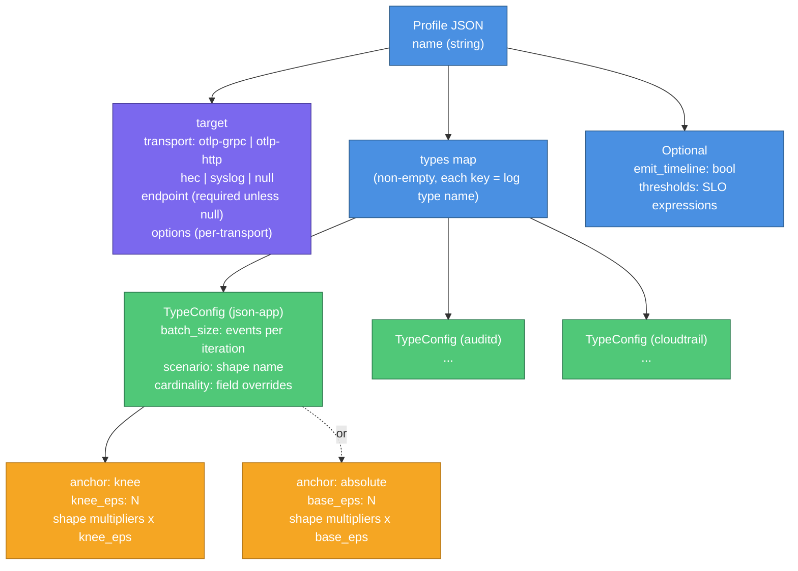
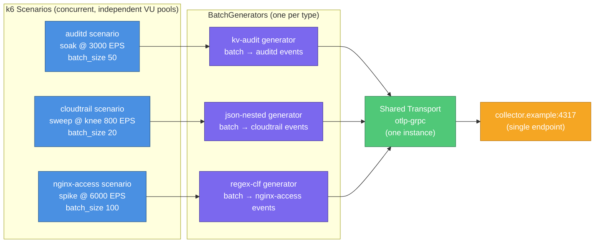

# k6-load-gen User Guide

k6-load-gen is a configurable load generator for observability pipelines. It drives k6 to send synthetic log events at controlled rates to a target aggregator — an OpenTelemetry Collector, a Splunk HEC endpoint, or a syslog receiver — so you can characterize how much event throughput your pipeline can sustain under realistic, mixed-type traffic.

---

## Table of Contents

1. [Prerequisites and Setup](#1-prerequisites-and-setup)
2. [Core Concepts](#2-core-concepts)
3. [Your First Run](#3-your-first-run)
4. [Profile Reference](#4-profile-reference)
5. [Log Types](#5-log-types)
6. [Load Shapes](#6-load-shapes)
7. [Environment Variables](#7-environment-variables)
8. [Reading Results](#8-reading-results)
9. [Multi-Type Runs](#9-multi-type-runs)
10. [Fleet Runs](#10-fleet-runs)
11. [Troubleshooting](#11-troubleshooting)

---

## 1. Prerequisites and Setup

### Running Inside the Container (Recommended)

The container image is the supported runtime environment. It includes:

- k6 v2.2.0 with the xk6-tcp extension (v0.3.1) — built into the image; cannot be changed at runtime
- Node.js 22 and the two CLI bundles (`timeline-cli`, `index-cli`)
- The AWS CLI v2 (for S3 artifact shipping)
- Six shipped profiles in `/app/profiles/`
- OpenTelemetry proto files in `/protos/`

No installation is needed when using the container. See the [Deployment Guide](deployment-guide.md) for how to build the image and run it.

### Running Locally (Development)

To run the k6 script or CLI tools outside the container:

**Requirements:**

- k6 v2.2.0 with the xk6-tcp extension. The extension is required for the syslog transport. Build it with `xk6 build v2.2.0 --with github.com/grafana/xk6-tcp@v0.3.1`.
- Node.js 22 (for CLI tools and TypeScript development).

**Build steps from a clean checkout:**

```bash
npm install          # installs all devDependencies
npm run build:cli    # produces dist/timeline-cli.js and dist/index-cli.js
```

The k6 script (`src/main.ts`) is **not** bundled separately — k6 executes TypeScript source directly. You do not need to compile `src/main.ts`.

**Proto file setup for local runs with OTLP-gRPC:**

The proto files are already in the repository under `protos/`. Set `PROTO_ROOT` to the absolute path of that directory:

```bash
export PROTO_ROOT=/path/to/repo/protos
```

The default inside the container is `/protos` (already set in the image). If you omit `PROTO_ROOT` when running locally with the `otlp-grpc` transport, k6 will fail at init with a file-not-found error for the proto files.

---

## 2. Core Concepts

### Profiles

A **profile** is a JSON file that describes a complete test configuration. It declares:

- Which transport to use (where to send events)
- Which log types to generate and at what rates
- Which load shape each type follows
- Optional SLO thresholds that determine pass/fail

Profiles live in `profiles/`. You select one by name with the `PROFILE` environment variable (without the `.json` extension). You can override most profile settings at invocation time with environment variables; you never need to edit a profile to change a single run's rate.

### Log Types

A **log type** is a named definition of a synthetic log format. Each type has a format family (JSON, key-value, Combined Log Format, or nested JSON), a set of fields with controlled cardinality and value distributions, and a registered parser configuration for downstream aggregators.

Four log types are available:

| Type name | Format | Real-world analog |
|---|---|---|
| `json-app` | Flat JSON object | Application structured logs |
| `auditd` | Key=value pairs | Linux auditd SYSCALL records |
| `nginx-access` | Combined Log Format | nginx access logs |
| `cloudtrail` | Nested JSON with envelope | AWS CloudTrail management events |

### Load Shapes

A **load shape** defines how the target events-per-second rate changes over time. Shapes range from a quick 20-iteration smoke test to a 4-hour soak. Each type in a profile has its own shape, running as a separate k6 scenario concurrently with any other types.

### Anchor

The **anchor** in each type's configuration sets the EPS reference point for the shape's multipliers. There are two modes:

- **`knee` mode** — you estimate where the pipeline starts to saturate (`knee_eps`). Shape multipliers scale relative to that estimate. Use this when exploring behavior near and past capacity.
- **`absolute` mode** — you pin the target rate directly (`base_eps`). Use this for regression runs or soak tests at a known fraction of capacity.

The `<TYPE>_RATE` env var override always forces absolute mode for that type and takes precedence over the profile's anchor.

### Transports

A **transport** is the protocol used to send events. All types in a profile share one transport — events from every active type go to the same endpoint via the same protocol.

The five transports are: `otlp-grpc`, `otlp-http`, `hec` (Splunk HTTP Event Collector), `syslog` (TCP, RFC 5424 or 3164), and `null` (discard, used for calibration and local testing).

---

## 3. Your First Run

The `local-null` profile sends events to the null transport (no network target) using the smoke shape (20 iterations, 1 VU). It is the fastest way to verify the tool works.

```bash
PROFILE=local-null RUN_ID=my-first-run bin/run.sh
```

After the run completes, check the results in the default work directory:

```bash
ls /tmp/k6run/
# summary.json   run.log
```

Open `summary.json` to see the run report. The `validity.valid` field tells you whether the run was measurement-valid. The `payload_sample` array shows the first few events the generator produced — use these to verify the format before pointing the tool at a real target.

> **Running on ECS?** The examples in this section use `bin/run.sh` directly (local container or shell). For ECS task definitions, `--overrides` injection, scheduled test patterns, and fleet orchestration on ECS, see the [Deployment Guide](deployment-guide.md).

### Minimal run against a real target

Pick the profile that matches your target's protocol. This example uses OTLP-HTTP:

```bash
PROFILE=otlp-http \
RUN_ID=sweep-001 \
TARGET=http://your-collector:4318 \
bin/run.sh
```

`TARGET` overrides the endpoint declared in the profile. The `otlp-http` profile uses the `sweep` shape, which runs for approximately 21 minutes and steps through seven load levels from 10% to 150% of `knee_eps`.

---

## 4. Profile Reference

### Schema

```json
{
  "name": "my-profile",
  "target": {
    "transport": "otlp-http",
    "endpoint": "http://collector:4318",
    "options": {}
  },
  "types": {
    "json-app": {
      "batch_size": 10,
      "anchor": { "mode": "knee", "knee_eps": 1000 },
      "scenario": "sweep",
      "cardinality": {}
    }
  },
  "emit_timeline": true,
  "thresholds": {
    "send_failures": "rate<0.001"
  }
}
```

The diagram below shows how profile fields relate to each other and what each field controls at runtime.



**`name`** — non-empty string; appears in run reports.

**`target.transport`** — one of `otlp-grpc`, `otlp-http`, `hec`, `syslog`, `null`.

**`target.endpoint`** — required for every transport except `null`. For `otlp-grpc`, use `host:port` format (no scheme). For `otlp-http` and `hec`, use an `http://` or `https://` URL. For `syslog`, use `host:port`.

**`target.options`** — transport-specific options. See [Transport Options](#transport-options) below.

**`types`** — required, non-empty map. Each key is a log type name (`json-app`, `auditd`, `nginx-access`, `cloudtrail`). Each value is a `TypeConfig`. All types in the map run simultaneously as separate k6 scenarios.

**`emit_timeline`** — whether to produce `timeline.jsonl`. Defaults to the profile value; overridable with `EMIT_TIMELINE` env var.

**`thresholds`** — k6 threshold expressions keyed by metric name. These are your SLO gates — a threshold failure causes k6 to exit with a non-zero code.

Note: the legacy top-level `payload`, `anchor`, and `scenario` fields from earlier profile versions are rejected. If you have profiles from a previous version, you must migrate them to the `types` map structure.

### TypeConfig Fields

**`batch_size`** — positive integer. Number of events sent per k6 iteration. A larger batch reduces the iteration rate and increases per-send payload size. The achieved EPS is:

```
iterations_per_sec = max(1, round(eps / batch_size))
actual_eps = iterations_per_sec * batch_size
```

This rounding means achieved EPS may differ slightly from requested EPS. The `delta_pct` field in the run summary reports the worst rounding drift across all stages.

**`anchor`** — sets the EPS reference for this type's shape multipliers:

```json
{ "mode": "knee", "knee_eps": 1000 }
{ "mode": "absolute", "base_eps": 500 }
```

**`scenario`** — the load shape name. See [Load Shapes](#6-load-shapes).

**`pre_allocated_vus`** — optional positive integer, default 200. k6's `preAllocatedVUs` for this type's `ramping-arrival-rate` scenario: the VU pool k6 starts with. If the pool is too small for the offered rate, k6 records `dropped_iterations` and the run is marked invalid — raise this before reaching for a bigger task. Ignored by the `smoke` shape.

**`max_vus`** — optional positive integer, default 10 × `pre_allocated_vus`. k6's `maxVUs`; must be greater than or equal to `pre_allocated_vus`.

**`cardinality`** — optional map of field name to positive integer, overriding the number of distinct values generated for overridable fields of this log type. Only fields with a bounded numeric cardinality can be overridden; fields with a fixed value list cannot. See [Per-Type Cardinality Overrides](#per-type-cardinality-overrides).

### Transport Options

#### `otlp-grpc`

| Option | Type | Default | Description |
|---|---|---|---|
| `plaintext` | boolean | `true` | Set `false` to enable TLS. Default is plaintext — set `false` for production endpoints that require encryption. |
| `timeout` | string | `"10s"` | gRPC call timeout. |
| `resource_attributes` | object | — | Key-value pairs merged into OTLP resource attributes alongside `service.name: "k6-load-gen"`. |

#### `otlp-http`

| Option | Type | Default | Description |
|---|---|---|---|
| `path` | string | `"/v1/logs"` | HTTP path for the logs endpoint. |
| `encoding` | `"json"` | `"json"` | Only `"json"` is implemented. Setting `"protobuf"` causes an init-time error. |
| `headers` | object | — | Extra HTTP headers. Any headers object is redacted from run artifacts. |

#### `hec`

| Option | Type | Default | Description |
|---|---|---|---|
| `token_env` | string | `"HEC_TOKEN"` | Name of the environment variable holding the bearer token. The profile stores the variable name, not the token itself. |
| `path` | string | `"/services/collector/event"` | HEC endpoint path. |
| `index` | string | — | Splunk index. |
| `sourcetype` | string | — | Splunk sourcetype. |
| `gzip` | boolean | — | Gzip the request body. When `true`, `wire_bytes` is not measured (k6 compresses after the payload string is built). |

#### `syslog`

| Option | Type | Default | Description |
|---|---|---|---|
| `rfc` | `5424` or `3164` | `5424` | Syslog protocol variant. |
| `framing` | `"octet-counted"` or `"lf"` | — | Message framing mode. |
| `tls` | boolean | `false` | Enable TLS on the TCP connection. |
| `app_name` | string | — | Syslog APP-NAME field. |

**Important — syslog throughput ceiling:** The syslog transport opens a new TCP connection for every batch, sends the events, and closes the connection. This is intentional — a persistent connection would hang the k6 process at shutdown — but it means throughput is bounded by TCP handshake latency and the system's TIME_WAIT ephemeral-port ceiling. At high event rates, you will hit this ceiling before hitting an aggregator bottleneck. Generator-side connection errors at high syslog rates are port exhaustion, not an aggregator problem. To reduce the impact: increase `batch_size` (fewer connections per second) or compare results from an HTTP-based transport.

#### `null`

| Option | Type | Default | Description |
|---|---|---|---|
| `count_bytes` | boolean | `true` | Whether to sum event body lengths for the `wire_bytes` metric. Set `false` to skip byte counting. |

### Per-Type Cardinality Overrides

The `cardinality` map in a `TypeConfig` controls how many distinct values a given field generates. This affects whether your aggregator's cardinality-dependent structures (HyperLogLog sketches, field dictionaries, high-cardinality indexes) scale with test duration.

Only fields with a bounded numeric cardinality can be overridden. The tables below show which fields are overridable for each log type.

**json-app:**

| Field | Overridable | Default cardinality |
|---|---|---|
| `host` | Yes | 500 |
| `service` | Yes | 20 |
| `level` | No — fixed values list | — |
| `trace_id` | No — unbounded | — |
| `message` | Yes | 50 |

**auditd:**

| Field | Overridable | Default cardinality |
|---|---|---|
| `arch` | Yes | 2 |
| `syscall` | Yes | 40 |
| `success` | No — fixed values list | — |
| `exit` | Yes | 15 |
| `uid` | Yes | 800 |
| `gid` | Yes | 200 |
| `exe` | No — unbounded | — |
| `key` | Yes | 10 |

**nginx-access:**

| Field | Overridable | Default cardinality |
|---|---|---|
| `remote_addr` | Yes | 2000 |
| `remote_user` | No — fixed values list | — |
| `request_method` | No — fixed values list | — |
| `request_uri` | No — unbounded | — |
| `server_protocol` | No — fixed values list | — |
| `status` | No — fixed values list | — |
| `body_bytes_sent` | Yes | 800 |
| `http_referer` | No — fixed values list | — |
| `http_user_agent` | Yes | 50 |

**cloudtrail:**

| Field | Overridable | Default cardinality |
|---|---|---|
| `userIdentity.type` | No — fixed values list | — |
| `userIdentity.arn` | No — unbounded | — |
| `eventName` | Yes | 40 |
| `awsRegion` | Yes | 12 |
| `sourceIPAddress` | Yes | 5000 |
| `eventID` | No — unbounded | — |

Note: for cloudtrail, use the dotted field path as the key (e.g., `"userIdentity.type"` — the dot is part of the field name).

Attempting to override a non-overridable field produces a validation error at init time before the test starts:

```
types.json-app.cardinality.level: field "level" has a fixed set of values and does not support a cardinality override
```

### Shipped Profiles

Six profiles are included in the image at `/app/profiles/`:

| Profile | Transport | Shape | Active types | Notes |
|---|---|---|---|---|
| `local-null` | `null` | `smoke` | `json-app` | No network target. `emit_timeline: false`. Threshold: `send_failures: rate<0.001`. Anchor: `absolute, base_eps: 1000`. |
| `otlp-grpc` | `otlp-grpc` | `sweep` | `json-app` | `plaintext: true` by default. |
| `otlp-http` | `otlp-http` | `sweep` | `json-app` | |
| `hec` | `hec` | `sweep` | `json-app` | Reads `HEC_TOKEN` env var by default. |
| `syslog` | `syslog` | `sweep` | `json-app` | RFC 5424, octet-counted framing, `tls: false`, `app_name: k6-load-gen`. `batch_size: 100`, `knee_eps: 5000`. Thresholds: `send_failures: rate<0.001`, `send_duration: p(99)<1000`. |
| `mixed-estate` | `otlp-grpc` | mixed | `auditd`, `cloudtrail`, `nginx-access` | Three types with different rates and scenarios, all sharing one gRPC transport (`plaintext: true`). `auditd`: absolute 3000 EPS, soak, batch 50. `cloudtrail`: knee 800 EPS, sweep, batch 20. `nginx-access`: absolute 6000 EPS, spike, batch 100. All types include cardinality overrides. |

---

## 5. Log Types

### json-app

Synthetic structured application log in flat JSON format. Fields:

- `host` — 500 distinct values, Zipf distribution (a few hosts dominate traffic)
- `service` — 20 distinct values
- `level` — `INFO`, `WARN`, `ERROR` with weights (~80% INFO, ~15% WARN, ~5% ERROR)
- `trace_id` — unbounded; every event gets a unique value
- `message` — 50 distinct values, padded to 512 bytes

Example event body:
```json
{"host":"host-042","service":"svc-7","level":"INFO","trace_id":"a1b2c3d4e5f6...","message":"processed item ...                                                          "}
```

### auditd

Synthetic Linux auditd SYSCALL record in space-separated `key=value` format. Fields:

- `type=SYSCALL` (constant, always present)
- `arch` — 2 distinct values (bare numeric digits)
- `syscall` — 40 distinct values, Zipf distribution, bare numeric digits
- `success` — `yes` or `no` with weights
- `exit` — 15 distinct values, Zipf distribution, bare numeric digits
- `uid` — 800 distinct values, Zipf distribution, bare numeric digits
- `gid` — 200 distinct values, Zipf distribution, bare numeric digits
- `exe` — unbounded; every event gets a unique value with prefix `/usr/bin/host-`
- `key` — 10 distinct values

Example event body:
```
type=SYSCALL arch=2 syscall=1 success=yes exit=0 uid=1000 gid=1000 exe=/usr/bin/host-abc123 key=audit-key-3
```

### nginx-access

Synthetic nginx Combined Log Format access log. Fields:

- `remote_addr` — 2000 distinct values, Zipf distribution
- `remote_user` — always `-`
- `request_method` — GET/POST/PUT/DELETE with weights (GET dominant)
- `request_uri` — unbounded; every event gets a unique URI with prefix `/api/v2/items?id=`
- `server_protocol` — always `HTTP/1.1`
- `status` — 200, 301, 404, 500 with weights (200 dominant)
- `body_bytes_sent` — 800 distinct values, Zipf distribution, bare numeric digits
- `http_referer` — always `-`
- `http_user_agent` — 50 distinct values

Example event body:
```
203.0.113.42 - - [31/Aug/2026:14:00:00 +0000] "GET /api/v2/items?id=xyz123 HTTP/1.1" 200 1234 "-" "agent-7"
```

### cloudtrail

Synthetic AWS CloudTrail management event in nested JSON wrapped in a `Records[]` envelope. Fields:

- `eventVersion: "1.08"` (constant)
- `userIdentity.type` — `AssumedRole`, `IAMUser`, or `Root` with weights
- `userIdentity.arn` — unbounded; every event gets a unique value with prefix `arn:synthetic::0:role/r-`
- `eventName` — 40 distinct values, Zipf distribution
- `awsRegion` — 12 distinct values with prefix `region-`
- `sourceIPAddress` — 5000 distinct values, Zipf distribution
- `eventID` — unbounded; every event is unique

**All cloudtrail field values are synthetic tokens.** There are no real AWS account numbers, real ARNs, or real API call names. The repository is public and was designed this way intentionally.

Example event body:
```json
{"Records":[{"eventVersion":"1.08","userIdentity":{"type":"AssumedRole","arn":"arn:synthetic::0:role/r-abc123"},"eventName":"event-12","awsRegion":"region-3","sourceIPAddress":"192.168.1.42","eventID":"uuid-xyz"}]}
```

---

## 6. Load Shapes

Each shape is identified by name and assigned per type in `TypeConfig.scenario`. All shapes except `smoke` use k6's `ramping-arrival-rate` executor and have their stage durations scaled by `DURATION_SCALE`.

### Shape Reference

| Shape | Purpose | Approximate duration |
|---|---|---|
| `smoke` | Verifies config and transport connectivity. 20 iterations, 1 VU. | Depends on transport latency; no time limit |
| `calibrate` | Measures generator maximum output. Ramps from 0.5x to 8x in 5 steps (30s ramp + 60s hold each). | ~450s |
| `sweep` | Finds the pipeline's knee EPS. 7 steps from 0.1x to 1.5x (15s ramp + 165s hold each). | ~1260s (~21 min) |
| `staircase` | Characterizes behavior past the knee. 6 steps from 0.5x to 3.0x (15s ramp + 285s hold each). | ~1800s (~30 min) |
| `breakpoint` | Finds the absolute throughput ceiling. Single ramp from 0.1x to 5.0x over 1800s. Stops on threshold failure (`abort_on_fail`). | Up to 1800s (~30 min) |
| `spike` | Tests recovery from a sudden large spike. 1.0x baseline (300s), 4.0x spike (600s), return to 1.0x (120s). | ~1050s |
| `sawtooth` | Tests autoscaling stabilization. 4 cycles of 2.5x (300s) down to 1.0x (300s). | ~2400s (~40 min) |
| `burst-idle` | Simulates cold buffer / incident-storm patterns. 6 cycles of 0.05x (300s) then 3.0x (30s). | ~1980s |
| `plateau` | Steady-state baseline at 2.0x for 900s. | ~900s (~15 min) |
| `soak` | Detects resource leaks over time. 0.7x for 14400s. | ~14400s (4 hours) |
| `backpressure-hold` | Observes continuous above-capacity behavior. 2.5x ramp (60s) then 2.5x hold (1200s). | ~1260s |
| `recovery` | Measures drain time after overload. 1.0x (300s), 3.0x overload (600s), 0.05x trailing idle (900s). | ~1800s |

### Multipliers and Anchor

Shapes express their target rates as multipliers of the anchor EPS. For example, `sweep` step 1 targets `0.1 × knee_eps` and step 7 targets `1.5 × knee_eps`. In `absolute` mode, `base_eps` serves as the reference value for the same multipliers.

### Scaling Duration

Set `DURATION_SCALE` to multiply all stage durations for `ramping-arrival-rate` shapes. `DURATION_SCALE=0.5` halves all stage durations; `DURATION_SCALE=2` doubles them. This is useful for quick spot checks (`DURATION_SCALE=0.1`) or for extending soak tests without creating a custom profile.

`DURATION_SCALE` has **no effect** on the `smoke` shape. Smoke always produces exactly 20 iterations and 1 VU regardless of this variable.

### Overriding Shape at Invocation Time

Use `<TYPE>_SCENARIO` to override the shape for a specific type without editing the profile:

```bash
JSON_APP_SCENARIO=soak PROFILE=otlp-http RUN_ID=soak-001 TARGET=http://collector:4318 bin/run.sh
```

---

## 7. Environment Variables

### Run Identity

| Variable | Required | Description |
|---|---|---|
| `PROFILE` | Yes | Profile name without `.json` extension (e.g., `otlp-http`). |
| `RUN_ID` | Yes | Unique identifier for this run. Must match `[A-Za-z0-9._-]+`. Used in artifact filenames and S3 keys. |

`RUN_ID` is your responsibility to make unique per run. The tool does not auto-generate one. If two runs share the same `RUN_ID`, each run overwrites the previous run's `summary.json`, `run.log`, and `raw.json.gz` in S3 without warning.

### Target and Scale

| Variable | Required | Description |
|---|---|---|
| `TARGET` | No | Overrides `target.endpoint` in the profile. |
| `DURATION_SCALE` | No | Multiplies all stage durations for `ramping-arrival-rate` shapes. No effect on `smoke`. |

### Type Selection and Per-Type Overrides

| Variable | Required | Description |
|---|---|---|
| `TYPES` | No | Comma-separated subset of type names declared in the profile (e.g., `TYPES=auditd,nginx-access`). Only the listed types run; others are skipped. |
| `<TYPE>_RATE` | No | Override anchor to absolute mode at this EPS for the named type. |
| `<TYPE>_KNEE_EPS` | No | Override the knee EPS for the named type. Only meaningful in `knee` anchor mode. |
| `<TYPE>_SCENARIO` | No | Override the scenario shape for the named type. |
| `<TYPE>_BATCH_SIZE` | No | Override the batch size for the named type. |

**Deriving the environment variable prefix from a type name:** uppercase the type name and replace every hyphen with an underscore.

| Log type | Env prefix | Example variable |
|---|---|---|
| `json-app` | `JSON_APP` | `JSON_APP_RATE=2000` |
| `auditd` | `AUDITD` | `AUDITD_SCENARIO=soak` |
| `nginx-access` | `NGINX_ACCESS` | `NGINX_ACCESS_BATCH_SIZE=50` |
| `cloudtrail` | `CLOUDTRAIL` | `CLOUDTRAIL_KNEE_EPS=500` |

**Legacy variables removed:** The former global overrides `RATE`, `SCENARIO`, and `KNEE_EPS` no longer work. Setting any of them now causes an immediate init-time error with migration instructions pointing to the per-type form. Replace `RATE=500` with `JSON_APP_RATE=500` (or the appropriate type prefix).

The tool emits a warning (but does not fail) if you set a per-type override for a type that is not active in the current run. The variable has no effect in that case.

If `TYPES` names a type not declared in the profile's `types` map, the run fails at init with a clear error and no `summary.json` is produced.

### Artifact Output

| Variable | Required | Description |
|---|---|---|
| `RESULTS_URI` | No | Destination for run artifacts. Use `s3://bucket/prefix` for S3 or an absolute directory path for local storage. If unset, artifacts stay in `$WORKDIR`. |
| `EMIT_TIMELINE` | No | `1` or `0`. Overrides the profile's `emit_timeline` flag. When `1`, produces `raw.json` during the run and processes it into `timeline.jsonl` afterward. |
| `KEEP_RAW` | No | Set to `1` to retain the gzipped raw k6 sample stream (`raw.json.gz`) in the artifact output. |
| `TIMELINE_BUCKET_SEC` | No | Timeline aggregation window in seconds. Default: 15. |
| `WORKDIR` | No | Working directory for in-progress files. Default: `/tmp/k6run`. |

### Fleet Variables

| Variable | Required | Description |
|---|---|---|
| `GEN_COUNT` | No | Total number of generators in the fleet. Default: 1. With `GEN_INDEX` unset and `GEN_COUNT>1`, the container runs all N generators itself (single-task fleet, see [Fleet Runs](#10-fleet-runs)). |
| `GEN_INDEX` | No | This generator's zero-based index in the fleet. Set it to run exactly one generator in this container (multi-task fleet). Unset means 0 for a single generator, or "all of them" when `GEN_COUNT>1`. |

### Transport-Specific

| Variable | Required | Description |
|---|---|---|
| `HEC_TOKEN` (or custom name) | Required for HEC | Bearer token for Splunk HEC. Named by `target.options.token_env`; default variable name is `HEC_TOKEN`. |
| `PROTO_ROOT` | No | Path to the directory containing OpenTelemetry proto files. Default in container: `/protos`. For local development: set to the absolute path of the repo's `protos/` directory. |

### AWS

| Variable | Required | Description |
|---|---|---|
| `AWS_REGION` or `AWS_DEFAULT_REGION` | Required if `RESULTS_URI` is an S3 URI | AWS region for `aws s3 cp`. ECS Fargate does not inject this. If unset, all S3 uploads fail with a region resolution error. The run still completes; only S3 shipping fails. |

---

## 8. Reading Results

### Output Files

After a run, the following files are written to `$WORKDIR` (default `/tmp/k6run`):

| File | Always written? | Description |
|---|---|---|
| `summary.json` | Yes, if k6 runs at all | Structured run report (schema_version 2). |
| `run.log` | Yes | All k6 stdout and stderr output captured in real time. |
| `raw.json` | Only when `EMIT_TIMELINE=1` | Raw k6 sample stream (input to timeline-cli). |
| `timeline.jsonl` | Only when `EMIT_TIMELINE=1` and raw.json succeeded | Time-bucketed metrics, one JSON object per aggregation window. |

When `RESULTS_URI` is set to a local directory, `summary.json`, `run.log`, and (if present) `timeline.jsonl` are copied there in a flat layout — no date partitions. When `RESULTS_URI` is an `s3://` URI, all artifacts are uploaded with a date-partitioned key structure and an additional `index.json` flat search record is generated (S3 only, never written to a local directory).

### summary.json (schema_version 2)

The run report is the primary artifact for post-run analysis. Key sections:

**`run`**

- `run_id` — the `RUN_ID` you supplied
- `started_at`, `ended_at` — ISO 8601 timestamps
- `duration_sec` — wall-clock test duration in seconds (null if unavailable)
- `k6_version` — k6 version string from the runtime
- `active_types` — list of type names that ran in this test

**`validity`**

- `valid` — `true` if the run is measurement-valid
- `reasons` — list of reasons the run is invalid (empty when `valid: true`)
- `dropped_iterations` — number of iterations the generator could not keep up with. A non-zero count means the generator was the bottleneck, not the pipeline under test. Results from such a run cannot characterize the pipeline's true capacity.
- `generator_cpu` — always `null` (not yet implemented)

A run is invalid when `dropped_iterations > 0` or `events_attempted === 0` (no events were sent at all, which means the target was unreachable or a transport init failure occurred).

**`rate`**

- `requested_eps` — sum of peak EPS requested across all active types
- `achieved_eps` — sum of peak EPS actually achieved
- `delta_pct` — worst rounding drift across all stages of all active types. This is not the difference between `requested_eps` and `achieved_eps`. See [delta_pct Interpretation](#delta_pct-interpretation) below.

**`types`** — per-type breakdown

Each entry is keyed by type name. Each field is a number or `null` (null means the sub-metric was not produced for this type in this run — for example, a run with `TYPES=auditd` has no `cloudtrail` sub-metrics at all):

- `events_attempted` — total events batched for sending
- `events_sent` — total events successfully delivered
- `send_failures` — count of failed batch sends
- `send_errors` — count of error-classified failures
- `wire_bytes` — bytes sent (transport-dependent; see [wire_bytes Notes](#wire_bytes-notes) below)
- `send_duration` — a map of Trend statistics (`avg`, `min`, `med`, `max`, `p(90)`, `p(95)`, `p(99)`) in milliseconds, or `null` if no samples. This is a map, not a single number.

**`thresholds`**

- `slo` — list of SLO threshold results. These come from your profile's `thresholds` field and are the actual pass/fail gates.
- `structural_count` — number of internal plumbing thresholds k6 generated automatically (one per metric per active type). These force k6 to expose tagged sub-metrics in the summary data. They do not affect pass/fail and are excluded from the `slo` list. You will see them during a run in k6's console output; they are expected and harmless.

**`verdict_from`** — list of SLO threshold expressions that determined this run's verdict. Informational only — k6's own exit code is the actual gate for CI automation.

**`payload_sample`** — up to 10 sample events (split roughly evenly across active types) showing exactly what the generator produced for iteration 0 of each type. Use this to verify format, field names, and body shape without re-running the tool.

**`resolved_config`** — a redacted copy of the merged profile. Credentials are removed; transport option values not on the safe allowlist appear as `"[redacted]"`. The endpoint URL is included because it is infrastructure metadata, not a credential.

### delta_pct Interpretation

`delta_pct` in `summary.json` is the **worst rounding drift across all stages**, not the gap between `requested_eps` and `achieved_eps`. It measures how precisely the EPS target was representable as a whole-number iteration rate given the `batch_size`.

In a multi-type run, the top-level `rate.delta_pct` is the worst across all types' worst stages. Each type also has its own `delta_pct` within its per-type summary.

A warning threshold of 2% is applied internally. High `delta_pct` means the combination of anchor EPS, `batch_size`, and the shape's stage multipliers produced coarse rounding in `iterations_per_sec`. To reduce drift: increase `batch_size` (so the iteration rate is a smaller number with less rounding impact), or choose an anchor EPS that is a round multiple of your `batch_size`.

### wire_bytes Notes

`wire_bytes` availability varies by transport:

| Transport | Populated? | What is measured |
|---|---|---|
| `otlp-grpc` | Never (`null`) | k6 does not expose the encoded protobuf byte count |
| `otlp-http` | On successful sends | Uncompressed JSON string length |
| `hec` | When `gzip: false` | Uncompressed JSON string length. `null` when `gzip: true` |
| `syslog` | On successful sends | Formatted syslog payload string length |
| `null` | When `count_bytes: true` (default) | Sum of event body lengths for all events in the batch |

All `wire_bytes` measurements use JavaScript string length (UTF-16 code units), not UTF-8 byte counts. For ASCII-dominant log content the difference is negligible.

When `wire_bytes` is `null` for a type in `summary.json`, it means the transport never produced a measurable byte count for that type (e.g., `otlp-grpc` always produces `null`), not that zero bytes were sent.

### Thresholds

Use these metric names in `profile.thresholds`:

| Metric | Type | Example expression | Notes |
|---|---|---|---|
| `events_attempted` | Counter | `count>0` | Validity check |
| `events_sent` | Counter | `count>0` | Successful delivery |
| `send_failures` | Rate | `rate<0.001` | Fraction of failed batches |
| `send_errors` | Counter | `count<10` | Absolute error count |
| `send_duration` | Trend | `p(99)<250` | Batch send latency in ms |
| `wire_bytes` | Counter | `count>0` | Only populated for some transports |

You can write per-type thresholds using k6 tag syntax:

```json
"thresholds": {
  "send_failures{scenario:auditd}": "rate<0.001",
  "send_duration{scenario:nginx-access}": "p(99)<200"
}
```

The `dropped_iterations` threshold (`count<1`) is reserved for validity checking and cannot be overridden by the profile.

### timeline.jsonl

Each line is a `TimelineBucket` JSON object covering one aggregation window (default 15 seconds). The `send_duration_p50`, `send_duration_p95`, and `send_duration_p99` fields are `null` (not 0) when no `send_duration` samples arrived during that window — for example, if all batches returned errors in that window. A value of `null` means "no data", not "zero latency".

---

## 9. Multi-Type Runs

A single container run can generate multiple log types simultaneously. Declare them all in the profile's `types` map — each active type becomes a separate k6 scenario running concurrently. All types share one transport (they all send to the same endpoint).

The diagram below shows how three concurrent types each drive their own scenario (independent VU pool and rate schedule) while sharing a single transport to one endpoint.



The `mixed-estate.json` profile demonstrates this with three types:

```json
{
  "name": "mixed-estate",
  "target": {
    "transport": "otlp-grpc",
    "endpoint": "collector.example:4317",
    "options": { "plaintext": true, "timeout": "10s" }
  },
  "types": {
    "auditd": {
      "batch_size": 50,
      "anchor": { "mode": "absolute", "base_eps": 3000 },
      "scenario": "soak",
      "cardinality": { "key": 5 }
    },
    "cloudtrail": {
      "batch_size": 20,
      "anchor": { "mode": "knee", "knee_eps": 800 },
      "scenario": "sweep",
      "cardinality": { "eventName": 25 }
    },
    "nginx-access": {
      "batch_size": 100,
      "anchor": { "mode": "absolute", "base_eps": 6000 },
      "scenario": "spike",
      "cardinality": { "http_user_agent": 100 }
    }
  },
  "emit_timeline": true,
  "thresholds": { "send_failures": "rate<0.001" }
}
```

Each type runs its own k6 scenario with an independent VU pool and rate schedule. The `types` section of `summary.json` breaks down events, failures, and latency per type.

### Selecting a Subset at Invocation Time

Use `TYPES` to run only some of the types declared in the profile:

```bash
TYPES=auditd,nginx-access PROFILE=mixed-estate RUN_ID=audit-web-001 bin/run.sh
```

`cloudtrail` is skipped. Per-type metrics and the `types` map in `summary.json` only include the active types.

If you set `TYPES` to a type name not declared in the profile's `types` map, the run fails at init:

```
TYPES names unknown type(s) my-type; profile declares auditd, cloudtrail, nginx-access
```

### Per-Type Rate and Shape Overrides

Override any type's parameters without editing the profile:

```bash
PROFILE=mixed-estate \
RUN_ID=spike-audit-001 \
AUDITD_SCENARIO=spike \
AUDITD_RATE=3000 \
NGINX_ACCESS_BATCH_SIZE=100 \
bin/run.sh
```

---

## 10. Fleet Runs

A fleet is N generators sharing one `RUN_ID`, each with its own `GEN_INDEX`. Each generator targets `total_eps / gen_count` as its share of the fleet's aggregate load: with `GEN_COUNT=4` and `knee_eps=10000`, each generator targets 2500 EPS. Every event carries `(run_id, gen_index, seq)`, so the aggregator sees N distinct generator identities either way. There are two ways to run one.

### Single-task fleet (one container)

Set `GEN_COUNT=N` and leave `GEN_INDEX` unset. `bin/run.sh` starts N k6 processes (`GEN_INDEX` 0..N-1), each in its own `gen-<i>/` directory, waits for all of them, and merges their results:

- **One merged `summary.json`** with the same schema-2 shape as a single run plus a `fleet` block. Counts are summed; `rate.*` is already fleet-wide and is taken from one generator; `send_failures.rate` is recomputed from summed passes and fails; each SLO threshold is `ok` only if it was ok on every generator; `validity.valid` is the AND of the generators and requires every generator to have reported; `send_duration` percentiles are the **worst generator's** (an upper bound, not a true fleet percentile). `fleet.generators[]` keeps each generator's own exit code, counts, drift and validity so an unhealthy one stays visible, and `fleet.aggregation` records which rule produced each field.
- **One merged `timeline.jsonl`**, bucket by bucket (counts summed, `failure_rate` recomputed from summed samples, percentiles worst-of).
- **Every generator's own artifacts** as well, under `gen-<i>/` (local) or `runs/<run_id>/gen-<i>/` (S3), exactly as a multi-task fleet would produce them. The fleet artifacts land under `fleet/` and `runs/<run_id>/fleet/`, with index and timeline stems `<run_id>-fleet`.

The container's **exit code** is the worst generator's, with an explicit precedence: any non-zero code other than 99 (a crash or config error) beats 99, because a generator that never ran means the fleet's numbers are not a measurement; 99 beats 0. Console output is tagged `[gen-<i>]` per line.

Limits: the N processes share one task's CPUs, so this mode is for generator identity and one-launch convenience, not for scaling past a single task — the wrapper warns when `GEN_COUNT` exceeds the CPUs it can see. Memory and `raw.json` output scale with N; set `EMIT_TIMELINE=0` for very large in-task fleets. `smoke` runs its fixed iterations in every generator.

`dist/fleet-cli.js merge <out-dir> <gen-dir>...` is the same merge, usable by hand on any set of `gen-<i>/` directories — for example after downloading a multi-task fleet's summaries from S3.

### Multi-task fleet (one container per generator)

Set a distinct `GEN_INDEX` in each container. There is no central coordinator — generators run independently and each deposits its own artifacts under its own S3 key path.

**Configuration across all containers in the fleet (same):**

- `PROFILE` — same profile for all
- `RUN_ID` — same run ID for all (artifacts are separated by `gen_index` in the S3 key)
- `GEN_COUNT=N` — total number of generators

**Configuration per container (unique):**

- `GEN_INDEX=0`, `GEN_INDEX=1`, ..., `GEN_INDEX=N-1`

S3 key paths include `gen_index`, so each generator's artifacts land in a distinct location:

```
s3://bucket/prefix/runs/my-run-001/gen-0/summary.json
s3://bucket/prefix/runs/my-run-001/gen-1/summary.json
s3://bucket/prefix/runs/my-run-001/gen-2/summary.json
```

---

## 11. Troubleshooting

### Init-time errors (no summary.json produced)

**`hec transport: environment variable HEC_TOKEN is not set (named by target.options.token_env)`**

The variable named by `target.options.token_env` is not in the environment. Set `HEC_TOKEN=<your-token>` (or whatever `token_env` names in your profile). This error fires before any VU runs.

**`RATE is no longer supported. Use JSON_APP_RATE instead.`** (or similar for `SCENARIO`, `KNEE_EPS`)

Replace the removed global override variables with the per-type form. See the [env var prefix table](#deriving-the-environment-variable-prefix-from-a-type-name).

**`TYPES names unknown type(s) my-type; profile declares json-app, auditd`**

`TYPES` references a type not in the profile's `types` map. Check spelling. Validation is against the profile's declared types, not the global log type registry.

**`types.json-app.cardinality.level: field "level" has a fixed set of values and does not support a cardinality override`**

You attempted to override cardinality for a field that uses a fixed value list. Check the [cardinality override tables](#per-type-cardinality-overrides) for which fields are overridable.

**Proto file errors with `otlp-grpc`**

Set `PROTO_ROOT` to the absolute path of the `protos/` directory. Inside the container, the default is `/protos` (already set). For local runs: `export PROTO_ROOT=/absolute/path/to/repo/protos`.

**`otlp-http transport` init error about `"protobuf"` encoding**

The `otlp-http` transport only implements JSON encoding. Remove `encoding: "protobuf"` from `target.options` or omit the `encoding` key entirely.

### Runtime and results issues

**`validity.valid: false` with `dropped_iterations > 0`**

The generator could not keep up with the requested rate — the generator itself was the bottleneck, not the pipeline. To resolve: reduce the requested EPS, increase `batch_size` (fewer iterations at higher payload per iteration), run fewer active types per container, or use a fleet to distribute the load across multiple containers.

**`validity.valid: false` with `events_attempted: 0`**

No events were sent. Causes: wrong endpoint (`TARGET` misconfigured), network unreachable from the container, or a transport init failure that was not caught before the test started (check `run.log` for the specific error).

**All S3 uploads fail after the run**

Check that `AWS_REGION` or `AWS_DEFAULT_REGION` is set. ECS Fargate does not inject this variable. The warning message appears on stderr after k6 exits — it does not appear in `run.log`. Verify the IAM task role has `s3:PutObject` on the target bucket prefix.

**High `delta_pct` in run summary**

See [delta_pct Interpretation](#delta_pct-interpretation). Increase `batch_size` or choose an anchor EPS that is cleanly divisible by `batch_size`.

**Warning: `variable set for inactive type`**

You set `<TYPE>_RATE` (or similar) for a type that is not active in this run. The variable has no effect. This is a warning, not an error.

**Syslog runs fail at high rates with connection errors**

The syslog transport opens a new TCP connection per batch. At high rates, you can exhaust the system's ephemeral port range (TIME_WAIT accumulation). Reduce target EPS, increase `batch_size` to reduce connection frequency, or compare against an HTTP-based transport to confirm the bottleneck is generator-side port exhaustion rather than the aggregator.
